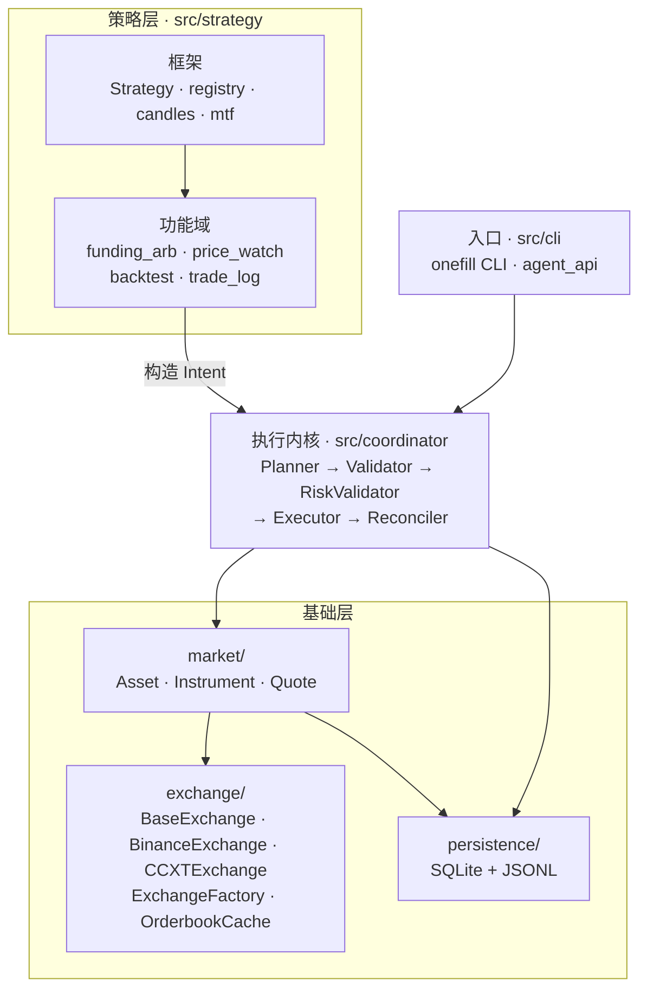

# Omnitrade

> Multi-venue coordinated order execution. Submit one order, fan out across exchanges in parallel, get a guaranteed coordinated final state.

## What it is

Manually placing the same order on multiple exchanges takes 30+ seconds. In that window, prices move and partial failures leave you with unwanted directional exposure. **Omnitrade's oneFill execution feature** compresses that window to milliseconds and handles the failure cases for you.

You submit a single CLI command — for example *"buy $1000 of BTC across Binance and Hyperliquid, 50/50 split, max slippage 0.3%"*. Omnitrade:

1. **Plans** — selects one `Instrument` per venue (BTC/USDT spot on Binance, BTC/USDC:USDC perp on Hyperliquid, etc.), fetches live quotes, and estimates per-leg price/slippage/fee.
2. **Validates** — checks listing status, balance, qty rules, leverage feasibility on each venue.
3. **Executes** — persists the plan to SQLite, then fans out all `create_order` calls via `asyncio.gather` (target: <50ms spread between request emissions).
4. **Reconciles** — failed openings use protected compensation to restore their recorded position baseline. Failed closes never reopen exposure; unresolved orders or positions enter `ROLLED_BACK_FAILED` (also called `NEEDS_MANUAL`) and block subsequent intents until manual correction and verified acknowledgement.

Omnitrade is an **execution platform**; its oneFill feature is an execution tool, not a strategy tool. It does not decide *whether* to trade or *how much* — the user (or, in the future, a Claude Agent SDK agent) does. It executes the user's already-decided intent.

Terminal states: `ALL_FILLED`, `REJECTED`, `ROLLED_BACK`, `ROLLED_BACK_FAILED`.

## Status

Omnitrade executes coordinated spot and perpetual orders with leverage and margin checks, funding-rate fetching, and protected compensation for partial openings. Binance supports ordinary one-way, single-asset accounts; dated futures and inverse-contract arbitrage are outside scope. Production hardening adds structured JSON logging, metrics hooks, an Agent entry point, and crash-recovery validation ([`scripts/chaos_test.py`](scripts/chaos_test.py)). Funding-rate arbitrage ships as a scanner plus the AutoArb daemon (`onefill arb`); the model and its rationale are in [`docs/developer-guide/design/strat-funding-arb.md`](docs/developer-guide/design/strat-funding-arb.md). For the verified current surface, see [`docs/developer-guide/reference/current-status.md`](docs/developer-guide/reference/current-status.md).

- **Venues:** Binance (Demo / mainnet, spot + USDⓈ-M perpetuals; COIN-M perpetuals opt-in) · Hyperliquid (testnet / mainnet, perp + spot)
- **Exchange surface:** typed execution methods; Binance uses three dedicated clients and rejects unsupported generic private operations.
- **Detailed snapshot:** [`docs/developer-guide/reference/current-status.md`](docs/developer-guide/reference/current-status.md) · **Product contract:** [`docs/developer-guide/design/sys-product-requirements.md`](docs/developer-guide/design/sys-product-requirements.md) · **Documentation rules:** [`docs/docs-paradigm.md`](docs/docs-paradigm.md)

## Quick start

```bash
# 1. Install uv if you don't have it: https://docs.astral.sh/uv/
uv sync --extra dev

# 2. Configure credentials
cp config/secrets.testnet.example.yaml config/secrets.testnet.yaml
chmod 600 config/secrets.testnet.yaml
# Keep network: "testnet"; fill in testnet credentials for your venues

# 3. (Optional) Review risk guardrails
# Edit config/risk.yaml to adjust max notional, daily loss limit, rate limiting
```

```bash
# 4. Preview a coordinated order without sending it
uv run onefill order --dry-run \
  --base BTC --quote-preference USDT,USDC \
  --product spot --side buy --type market \
  --total-notional-usd 100 \
  --split binance=0.5,hyperliquid=0.5 \
  --network testnet
```

```bash
# 5. Execute it for real (add --yes to skip the confirmation prompt)
uv run onefill order \
  --base BTC --quote-preference USDT,USDC \
  --product spot --side buy --type market \
  --total-notional-usd 1000 \
  --split binance=0.5,hyperliquid=0.5 \
  --max-slippage-pct 0.3 \
  --network testnet
```

```bash
# 6. Per-leg overrides: buy spot on Binance, short perp on Hyperliquid with 3x leverage
uv run onefill order --dry-run \
  --base BTC --quote-preference USDT,USDC \
  --product spot --side buy --type market \
  --total-notional-usd 500 \
  --split "binance=0.5:buy:spot,hyperliquid=0.5:sell:perp:3"
```

## CLI reference

The CLI is exposed as `onefill` (entry point: `src/cli/main.py:app`). Commands:

### `onefill order` — submit a coordinated intent

| Flag | Required | Default | Description |
|---|---|---|---|
| `--base` | yes | — | Base asset symbol, e.g. `BTC`, `ETH`, `SOL` |
| `--quote-preference` | no | `USDT,USDC` | Comma-separated list, tried in order when matching instruments |
| `--product` | yes | — | `spot` or `perp`. Default for all legs; individual legs can override via `--split` |
| `--side` | yes | — | `buy` or `sell`. Default for all legs; individual legs can override via `--split` |
| `--type` | yes | — | `market` or `limit` |
| `--total-notional-usd` | except close-all | — | USD sizing budget; maximum budget when native quantity is given |
| `--contract-type` / `--settlement-asset` | no | perp linear / — | Select linear or inverse perpetuals and settlement currency |
| `--leg-contract-type` / `--leg-settlement-asset` | no | — | Repeated `venue=value` overrides, preserving existing split syntax |
| `--position-effect` | no | `open` | Explicit `open` / `close`; failed close never reopens |
| `--close-all` / `--quantity-native` | no | — | Single-leg full perp close / exact native quantity with USD budget; mutually exclusive |
| `--split` | yes | — | Venue weights, e.g. `binance=0.5,hyperliquid=0.5` (must sum to 1.0). Each leg can optionally override side, product, and/or leverage: `binance=0.5:buy:spot,hyperliquid=0.5:sell:perp:3` |
| `--leverage` | no | `1` | Leverage (perp only). Default for all legs; individual legs can override via `--split`. Omnitrade calls `set_leverage()` on the exchange before placing perp orders |
| `--limit-price` | no | — | Price for limit orders |
| `--max-slippage-pct` | no | — | Fixed price protection versus the planning midpoint; if unset, execution uses a 0.5% protected limit tolerance. |
| `--max-fee-usd` | no | — | Reject the plan if total estimated fee exceeds this |
| `--max-funding-rate-pct` | no | — | Reject if perp funding rate exceeds this |
| `--execute-timeout` | no | `30` | Seconds before the executor times out and triggers reconciliation |
| `--time-in-force` | no | `IOC` | `GTC`, `IOC`, or `FOK`; unsupported venue capabilities reject. |
| `--poll-interval-ms` | no | `500` | Cap for adaptive HTTP polling backoff (starts at 50ms, doubles each round up to this cap). |
| `--no-websocket` | no | — | Disable WebSocket fill watching; use HTTP polling only. |
| `--network` | no | `testnet` | `testnet` or `mainnet` |
| `--dry-run` | no | — | Plan + validate + risk-check only; do not send orders |
| `--yes` | no | — | Skip the interactive confirmation prompt |
| `--json` | no | — | Emit machine-readable JSON instead of rich terminal output |

### `onefill query <intent-id>`

Show the full state of a single intent: per-leg fills, fees, timestamps, status transitions.

```bash
uv run onefill query 7a3f9b2c-…
```

### `onefill status <intent-id>` / `onefill binance-smoke`

`status --refresh --network testnet` refreshes order and position facts without orders, cancellation, or automatic unblocking.
`binance-smoke --network testnet --family spot|usdm|coinm` defaults to public read-only checks; `--account` adds private reads.
A Demo open/compensation cycle requires explicit `--allow-orders --notional-cap AMOUNT`. It reports `CLOSED` only after the durable protected cycle completes. No real Demo trades were used to validate this implementation.
See the [CLI reference](docs/user-guide/cli/index.md) and [Binance design](docs/developer-guide/design/base-binance-integration.md).

### `onefill list-intents [--status STATUS]`

List the 50 most recent intents, optionally filtered by status. Valid statuses include `PENDING`, `VALIDATED`, `EXECUTING`, `ALL_FILLED`, `REJECTED`, `ROLLED_BACK`, `ROLLED_BACK_FAILED`.

```bash
uv run onefill list-intents --status ROLLED_BACK_FAILED
```

### `onefill cancel <intent-id>`

Cancel a non-terminal intent in the store. Note: in the current MVP this does not cancel orders on the exchange itself if execution is already in flight — use exchange UIs for that.

### `onefill recover`

List intents stuck in `ROLLED_BACK_FAILED`, with suggested remediation. This state blocks all subsequent intents until resolved.

### `onefill venues`

Print configured venues from `config/exchanges.yaml`: type (ccxt / native), enabled flag, default network, supported symbols.

### `onefill instruments`

Browse the local instrument cache. Omnitrade persists every venue's trading pairs to SQLite on first run; subsequent starts load from cache (TTL 24h), avoiding repeated exchange API calls. Before executing an order, the cache is checked — if the requested pair doesn't exist on a venue, the order is rejected early with a clear message.

```bash
onefill instruments --base BTC              # all BTC pairs across venues
onefill instruments --venue binance         # all Binance pairs
onefill instruments --market perp           # perp only
onefill instruments --refresh               # force re-fetch from exchanges
onefill instruments --base BTC --json       # machine-readable output
```

The table shows venue, network, market and contract type, settlement asset, native quantity unit/size,
base, quote, venue minimums and listing status.

### `onefill ack <intent-id>`

Acknowledge a `ROLLED_BACK_FAILED` intent after manual correction using the original `--network` (default testnet). The coordinator verifies terminal orders and matching positions before transitioning to `RESOLVED_MANUAL`.

### `onefill arb`

Funding rate arbitrage scanner / AutoArb daemon.

```bash
# One-shot spread scan across perp pairs
uv run onefill arb scan --base BTC

# Continuous: scan → auto-open hedged positions → auto-close when spreads narrow
uv run onefill arb run --base BTC --interval 60 --dry-run

# List open hedged arbitrage positions
uv run onefill arb positions

# Funding rate history for a base asset on a venue
uv run onefill arb history BTC --venue binance
```

Subcommands: `scan` (one-shot), `run` (AutoArb daemon: `--min-spread`, `--exit-spread`,
`--notional`, `--interval`, `--max-positions`, `--dry-run`), `positions`, `history`.
Theory and rationale: [`docs/developer-guide/design/strat-funding-arb.md`](docs/developer-guide/design/strat-funding-arb.md).

### `onefill watch`

Price-watch + Telegram-alert daemon for a personal, tagged watchlist. Signals are
**paired-band rotation** (buy-the-dip / sell-the-rip): per asset, once the price
falls `--buy-drop-pct` from the recent window high it emits a BUY signal (and
records that price as the assumed buy price); later, when the price rises
`--sell-rise-pct` above that buy price it emits a SELL signal. Each asset cycles
flat → buy → sell, so signal count ≈ number of bands (no spam).

```bash
# Backfill the candle window for every asset in config/watchlist.yaml
uv run onefill watch backfill --network mainnet

# Run the daemon: every 10 min, fetch Hyperliquid→Binance candles, evaluate the
# paired-band signals, alert via Telegram
uv run onefill watch run --network mainnet
```

**`watch run` vs `watch backfill`** — both use the same `backfill()` seeding logic, but
only `watch run` is a daemon:

| | `watch run` (daemon) | `watch backfill` (one-shot) |
|---|---|---|
| What it does | Seeds at startup, then ticks every `--interval` to refresh each asset's candles, evaluate signals, and push Telegram alerts. | Fetches/backfills candle data once, then exits. No alerting, no tick loop. |
| Lifetime | Runs until Ctrl+C | Exits when done |
| Telegram | Required (unless `--dry-run`) | Not used (internally `--dry-run`) |
| Main use | Live monitoring + alerts | Pre-populate / top up the store (e.g. rebuild after a wipe, or fetch extra history) |

Because `watch run` also calls `backfill()` at startup, running `watch backfill` first
is optional — it just means the daemon's startup seed is a quick incremental top-up
instead of a deep fetch.

Config: `config/watchlist.yaml` — each entry needs `symbol` + `tag` (a category label
shown in alerts); optional `market_type` (default `perp`), `quote_preference`.
Telegram `bot_token` / `chat_id` go in `config/secrets.yaml` → `telegram:`.
Alerts include the asset's tag. Data is read from Hyperliquid first, falling back to
Binance when the asset is absent there. Flags: `--interval` (default `600s`),
`--timeframe` (default `5m`), `--window-days` (default `5`),
`--buy-drop-pct` (default `0.10`), `--sell-rise-pct` (default `0.15`),
`--signal-cooldown-hours` (default `6`; min interval between adjacent buy/sell
signals per asset — also implies a min-hold so sub-cooldown noise round-trips are
suppressed), `--telegram-cmd-interval` (default `120`; how often the bot polls
for `/subscribe` commands), `--dry-run`, `--network`.

**Telegram subscribers**: notify is broadcast to the `chat_id`(s) in `secrets.yaml`
(which double as the whitelisted "master" ids) **plus** any dynamically-subscribed
chats. A master can add a chat by sending `/subscribe` (or `/start`) to the bot —
in a group it subscribes that whole group, in a DM it subscribes the master.
`/unsubscribe` (or `/stop`) removes it, `/status` reports the counts. Non-master
messages are ignored.

**Trade logging**: a whitelisted master can log a trade in a **private chat** by
sending `/log` (a group chat rejects it). Minimal positional form:
`/log BTC buy 0.01 64000 [venue] [tag] [fee] [strategy] [reason]` — only
`symbol side qty price` are required; bare `/log` returns the template. A `sell`
auto-matches the most recent unmatched buy for that symbol and computes pnl
(`(sell-买)×qty − fee`). Persisted to the `trades` table (same as `onefill
trades record`), visible in `list` / `export`.

### `onefill backtest`

Replay the paired-band rotation strategy on historical data with a shared-cash
portfolio — it uses the **same `evaluate_band` signal engine** as `onefill
watch run`, so backtest signals match live alerts.

```bash
uv run onefill backtest run --network mainnet \
  --symbols BTC,ETH,SOL --days 30 --timeframe 5m \
  --capital 10000 --per-trade-usd 2000 --fee-rate 0.0005 \
  --buy-drop 0.10 --sell-rise 0.15 --window-days 5 --cooldown 6
```

Outputs metrics (return %, win rate, profit factor, max drawdown, trade count,
avg win/loss) and per-fill records; `--json` for machine-readable. Without
`--symbols` it uses the whole watchlist (slower — fetching N days each).

### `onefill trades`

Manual trade log (per-order journal) for strategy analysis — hand-recorded, not
derived from Omnitrade orders.

```bash
# Record a single order (omit --symbol/--side/--qty/--price to be prompted)
uv run onefill trades record \
  --symbol BTC --side buy --qty 0.01 --price 60000 \
  --tag 龙头 --strategy "10%破位" --reason "..."
# venue / tag / fee / pnl / strategy / reason / note / ts are optional

# List / export
uv run onefill trades list [--tag 龙头] [--json]
uv run onefill trades export --format csv|json [--out trades.csv]
```

Storage: `trades` table in SQLite (`data/onefill.db`). `tag` mirrors the watchlist
category label; `strategy` / `reason` are free-form for later analysis.

### Strategy interface

`src/strategy/` defines a `Strategy` ABC (`on_bar(bar) -> Signal`) plus a
`registry` (name → class). `pair_band` is the built-in strategy (the rotation
signal). Both `onefill watch run` and `onefill backtest run` accept
`--strategy <name>` and drive a per-symbol strategy instance — so **backtest
signals equal live alerts**. To add a strategy, implement the ABC, register it in
`src/strategy/algos/`, and it becomes usable for both warning and backtesting
(and can be compared against others).

### Exit codes

| Code | Meaning |
|---|---|
| `0` | `ALL_FILLED` — every leg filled within tolerances |
| `1` | General error (bad args, unreachable venue, etc.) |
| `2` | `REJECTED` — plan or validation failed; no orders sent |
| `3` | `ROLLED_BACK` — partial fill, compensation succeeded; net exposure flat |
| `4` | `ROLLED_BACK_FAILED` — compensation failed; manual intervention required |

These let you script multi-step workflows with safe failure handling.

## Risk controls

Omnitrade enforces pre-trade guardrails before any order reaches the exchange. Configure them in `config/risk.yaml`:

| Guard | Default | Description |
|---|---|---|
| `max_notional_per_intent` | `100000` | Reject any single intent above this USD notional |
| `daily_loss_limit_usd` | `10000` | Reject if cumulative filled-leg PnL today exceeds this loss |
| `max_venue_exposure_usd` | `50000` | Reject if any venue has too much filled-but-uncompensated notional |
| `rate_limit.max_orders` | `10` | Max intents per sliding window |
| `rate_limit.window_seconds` | `60` | Sliding window duration for rate limiting |

Set any value to `null` to disable that check. Risk failures appear in `--json` output as `risk_failures` and in the terminal as rejection reasons. The `RiskValidator` runs after Validate (balance / qty / listing checks) but before Executor (order dispatch), so a rejected risk check never sends an order.

Add `"risk_failures"` to your monitoring or scripts to catch risk rejections separately from validation failures.

## Architecture



- **Strategy layer** decides *whether* and *how much* to trade, and never sends orders itself — it builds an `Intent` and hands it to the execution core. Four feature domains ship today: funding-rate arbitrage (`arb`), price watch with Telegram alerts (`watch`), backtesting (`backtest`) and a manual trade journal (`trades`).
- **Market layer** abstracts venue/quote/product differences. An `Asset` is "BTC"; an `Instrument` is identified by `(venue, network, market_type, venue_symbol)` and carries base, quote, settlement, and quantity-unit attributes (e.g. BTC/USDT spot on Binance and BTC/USDC:USDC perp on Hyperliquid are different instruments). `Quote` is a point-in-time snapshot with depth-aware fill estimation.
- **Coordinator** is four independently-testable phases, plus a `RiskValidator` that runs between Validate and Execute. Planner and Validator have no side effects; Executor and Reconciler do. Fill confirmation uses WebSocket (`ccxt.watch_orders`) with automatic HTTP polling fallback; early termination exits the poll loop immediately when a leg fills and another definitively fails.
- **Persistence** writes every leg row to SQLite *before* the corresponding `create_order` is sent. JSONL is the append-only audit trail and can rebuild SQLite if needed. Instruments from every venue are cached in a local `instruments` table (TTL 24h) for fast startup and pre-flight validation.
- **Exchange layer** provides a dedicated `BinanceExchange` for Binance's three product clients, generic `CCXTExchange` connectivity for other CCXT venues such as Hyperliquid, and `MockExchange` as the canonical test double.

See [`CLAUDE.md`](CLAUDE.md) and [`docs/developer-guide/`](docs/developer-guide/index.md) for the current design, invariants, and state machine.

## Configuration

Shared configuration plus separate credentials for each network:

Arcus and Hyperliquid share the model of a master account authorizing an independent API signing key.
Their API identities differ: Arcus uses a raw Ed25519 public key; Hyperliquid uses a secp256k1-derived
EVM address. Their API fields and signing keys are not interchangeable. See the
[UI field mapping](docs/user-guide/configuration/credentials.md).

Write every credential value as a double-quoted string, including addresses, keys, secrets and
placeholders; use `""` for unset values. This avoids YAML interpreting hex/digits as numbers.
Single-quoted values that already parse as strings are not rejected for their quoting style.


- **`config/exchanges.yaml`** — per-venue enable flag, network URLs, fee schedule, symbols.
- **`config/risk.yaml`** — pre-trade guardrails: max notional, daily loss limit, venue exposure, rate limiting. See [Risk controls](#risk-controls) above.
- **`config/secrets.testnet.yaml`** / **`config/secrets.mainnet.yaml`** — exchange credentials (gitignored), with a matching top-level `network: "testnet"` / `network: "mainnet"` marker. Copy the corresponding `.example.yaml` template. Schema differs per venue:
  - **Binance:** `apiKey` + `secret` (HMAC); testnet uses Demo Trading keys.
  - **Hyperliquid:** `master_wallet_address` = funded master account; `api_wallet_address` / `api_wallet_private_key` = a separate API Wallet approved on the selected network. API address and derived signing address must match. Both API fields can be empty for read-only use; master-wallet signing keys are not accepted. Old `walletAddress` / `wallet_address` / `privateKey` / `private_key` fields must be migrated and removed. Optional `vaultAddress` targets signed actions but alone does not redirect public reads.
  - **Arcus:** webpage API Key → `api_key`, API Signing Key → `api_signing_key` (32-byte Ed25519, 64 hex characters; only the signing key accepts optional `0x`); `master_wallet_address` = authorizing Ethereum master. API Key is the raw Ed25519 public key, not an EVM API-wallet address. Old `address` / `wallet_address` and `apiKey` / `private_key` / `privateKey` fields must be renamed and removed.
- **`config/secrets.yaml`** — shared Telegram credentials (gitignored); copy `config/secrets.example.yaml` when needed.

`--network` / Python `target_network` selects endpoints and the matching credentials file together.
Without an override, each venue uses its `default_network`, falling back to `testnet`.
There is no fallback to the other network or the old shared credentials file. See
[Configuration](docs/user-guide/configuration/index.md) for migration and custom paths. For Binance,
the dedicated adapter enables ccxt's `enable_demo_trading(True)` for Demo Trading; Spot Testnet is
documented but not integrated.

## Testing

```bash
uv run --locked --extra dev --group docs pytest -m "not network"  # offline
uv run --locked --extra dev --group docs pytest tests/e2e/test_dex_testnet.py -s  # real testnet, read-only

uv run --locked --extra dev --group docs ruff check .              # lint
uv run --locked --extra dev --group docs ruff format --check .     # format gate
```

The dedicated Arcus / Hyperliquid suite only trades with `--dex-testnet-trades`. It targets
25 USD orders, caps each order at 100 USD and the entire run at 5000 USD, and uses fixed 0.5%
price protection. Existing positions, orders or spot holdings block the selected market.
Evidence goes to a new `/share/<current-user>/outputs/omnitrade/dex-testnet/<UTC timestamp>/`
directory with an independent database and `PASS` / `FAIL` / `BLOCKED` / `UNSUPPORTED` results.
See [DEX testnet validation](docs/user-guide/examples/dex-testnet-validation.md) for commands,
WS/recovery checks and account-mode limits. Adapter-level coverage does not imply ordinary
Coordinator support for Hyperliquid unified accounts.

## Risk disclaimer

Cryptocurrency trading carries significant market and compliance risk. Validate strategies on testnet before using real funds. This project is for technical research and education; nothing here is investment advice.
