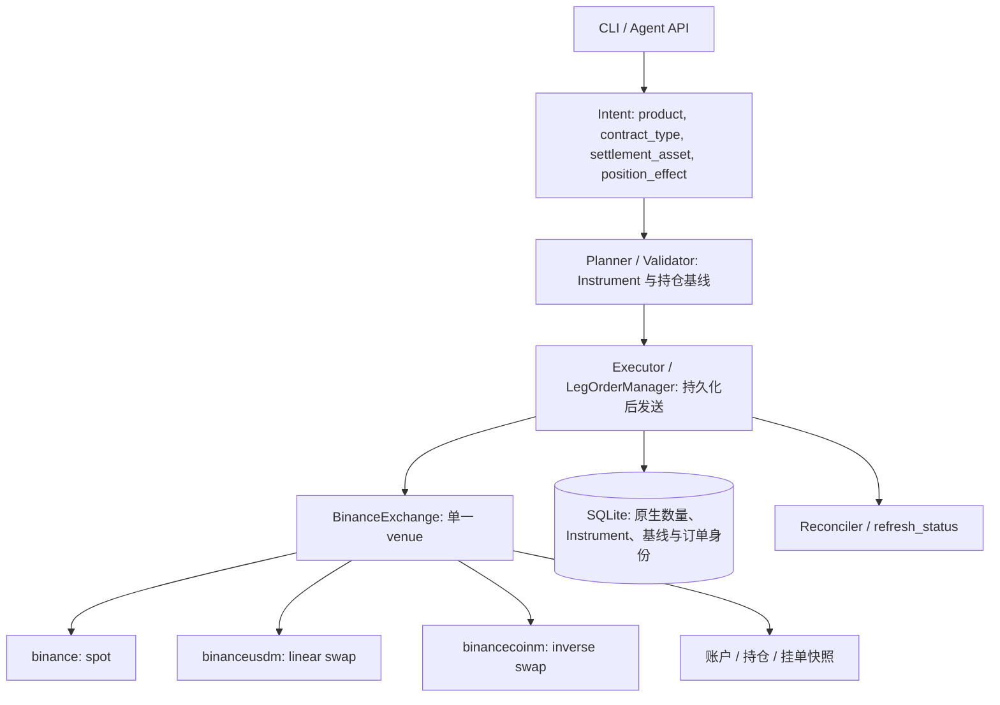

# Binance 现货与永续接入

## 范围与决策

项目保留一个 `venue="binance"`，支持现货、U 本位线性永续与币本位反向永续。
交割合约、期权、杠杆现货、组合保证金、双向持仓和多资产保证金不在执行范围。
币本位可以独立开平仓，不进入跨所价差或资金费率套利。

配置 `market_families: [spot, usdm]` 默认启用现货和 U 本位；币本位必须显式添加 `coinm`。
三个产品使用相同网络的 Binance 凭据；权限是否足够由各产品私有接口校验，
现货账户可查询不代表合约权限可用。`testnet` 固定表示 Demo Trading，
不能填入 Spot Testnet 的 key。生产与模拟凭据继续由 CLI 网络加载器隔离。

## 结构

`BinanceExchange` 直接实现 `BaseExchange`，不继承通用 `CCXTExchange` 的原始 API
包装器。已支持的类型化方法显式路由；未实现的泛化方法继承 `NotImplementedError`。
不提供一个指向任意产品的 `ccxt_exchange` 别名，调用方通过 `has_credentials` 查询凭据状态。

| family | CCXT 类 | 固定市场类型 | 账户 / REST 路由 |
|---|---|---|---|
| `spot` | `binance` | `spot` | 现货资产，`/api` |
| `usdm` | `binanceusdm` | `swap` + `linear` | 结算资产保证金，`/fapi` |
| `coinm` | `binancecoinm` | `swap` + `inverse` | 基础币保证金，`/dapi` |

三个实例隔离市场、账户状态及 CCXT 的杠杆档位缓存。单客户端逐次传 `subType` 被放弃：
本地 CCXT 的 `leverageBrackets` 缓存未按子类型分桶，且无 symbol 的余额、持仓、资金费率接口
不能依赖交易对自动选产品。symbol 与显式账户参数冲突时拒绝，不修改共享 `defaultType`。
批量资金费率和持仓按 family 拆分后合并，不把币本位查询发到 U 本位账户。

公开市场加载关闭私有币种和杠杆现货元数据查询，缺少凭据仍可读行情。各 family 独立报告
初始化错误；不能因为某产品失败就改用另一产品。底层目录含交割市场时，适配器仅接纳永续，
所有交易入口仍检查已接纳的品种索引。

内部 `account_family/type/subType` 在适配器内消费，不直接透传至 HTTP 参数；
固定客户端负责实际 API 选择，避免现货 depth 等接口拒绝额外路由参数。

## 数量与账户

`Instrument` 保留 `settlement_asset`、`quantity_unit`、`contract_size`、`is_inverse`。
`product="perp"` 默认选 `contract_type="linear"`；反向必须显式选择 `inverse`。
市场身份包含网络和完整 venue symbol，不能仅凭基础币和报价币覆盖缓存记录。

- 现货原生数量为基础币。
- 线性合约原生数量按合约乘数换算为基础币。
- 反向合约原生数量为张数，报价币名义金额为张数乘合约面值，基础币数量随成交价换算。

原生数量承担步长、拆单、成交确认与平仓比较；基础币数量用于展示与风险估值。
不能把两次不同价格下换算出的基础币数量当成反向合约是否平完的判据。
账户余额缓存与验证器预取键区分网络、family 和结算资产，币本位保证金从结算币读取。
手续费保留原币种，再按可用成交价格估值，未知费用不能视为零。
计划阶段使用公开市场或配置中的费率估计，实际账务以成交手续费为准。
Demo 现货的 CCXT 私有费率查询依赖未提供的 SAPI 路由，不能将其视为可用的费率查询能力，
也不能为了获取费率改发主网请求。

## 开平仓与恢复工作流

1. `position_effect="open"` 是默认操作；`close` 必须显式指定。
2. 预检读取账户模式、余额、持仓与挂单。普通账户、单向持仓、单资产保证金之外的模式拒绝，
   不替用户修改账户模式。保存发送前的持仓基线供恢复核对；账户模式在每次执行前读取验证。
3. `close_all` 仅适用于单腿永续平仓，可省略金额；部分平仓支持单腿 `quantity_native`，
   此时名义金额仍是保护预算。方向和数量必须确实减少已有持仓，永续关闭使用 `reduceOnly`。
4. 持久化完整 Instrument、原生数量、开平仓语义、基线和稳定 client order ID 后发送。
   WS 提示之后仍以 REST 累计成交与持仓核对为准。
5. 开仓失败只处理本次造成的增量，恢复目标是保存的基线。平仓失败不通过反向单重新开仓；
   无法确认、残余未完成或基线不一致时直接进入 `ROLLED_BACK_FAILED` 并阻断后续交易。
6. `status --refresh` 只刷新订单和持仓证据，不撤单、不补偿、不下单，也不自动清除阻断。
   人工确认必须遵循持久化状态和证据检查，不能通过刷新伪装完成。

## 网络、WebSocket 与额度

REST 和 WS 都从选定网络构造。Demo 初始化或端点校验失败即拒绝该产品，不能吞异常后沿用主网。
已绑定凭据的实例不支持原地网络切换；需要通过配置加载器重建。示例配置不再放一对误导性的
Binance 占位 URL，各产品地址由适配器派生并校验。

行情 WS 按 `spot/usdm/coinm` 建立固定客户端与缓存任务，市场数量按 Instrument 单位归一化。
私有订单流按同一 family 与网络订阅；WS 不可用时只降级到同网络 REST 查询。
限流额度由适配器与行情缓存共享，不能把三个 CCXT 实例当成三个独立的账户额度。
Binance 上游环境和模式调整的资料入口见 [API 参考](../../reference/binance-api-reference.md)。

## 验证与限制

`onefill binance-smoke --family spot|usdm|coinm --network testnet` 默认仅验证目录与盘口。
`--account` 增加私有账户和持仓读取；只有 `--allow-orders --notional-cap N` 才调用协调器执行
一轮受保护模拟交易，并核对恢复基线。主网 smoke 只允许读取。

离线测试覆盖账户路由、模式拒绝、反向数量、网络不回退、原单身份、部分成交、平仓失败不重开、
缓存隔离和数据库迁移。离线通过不表示已完成 Demo 订单验收；未运行真实订单时不得声称实测成交。

实现入口为 `src/exchange/binance.py`、`binance_clients.py`、`src/coordinator/`、
`src/market/instrument.py` 与 `src/cli/main.py`。测试按相同模块位于 `tests/`。

Smoke 的开仓与补偿属于同一个持久化 Intent：首次成交后保持 `EXECUTING`，
由 Reconciler 保护性补偿后保存 `ROLLED_BACK`，命令展示为 `CLOSED`。若进程中断，
恢复继续使用原有 client order ID 和订单事实；不能把两个独立 Intent 串联成存在崩溃间隙的开平仓。
