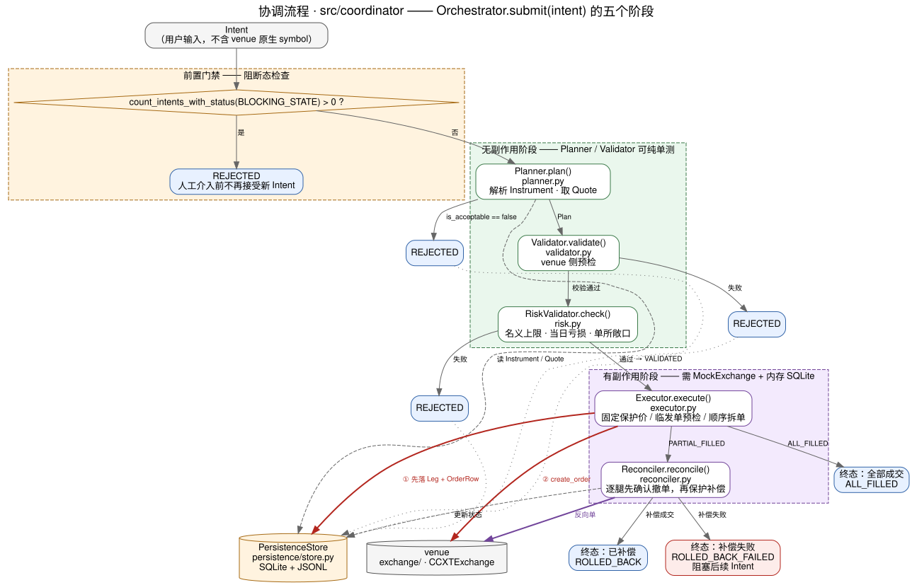

# 协调流程

`Orchestrator` 保留 Planner、Validator、RiskValidator、Executor、Reconciler 五个阶段。执行保护与故障处理的完整契约见[交易执行可靠性](base-execution-reliability.md)。

## Planner

`planner.py` 解析 Instrument 与逐腿 product/side/leverage/contract_type/settlement_asset，获取 Quote，验证 freshness、盘口和点差，向下取整数量并计算深度 VWAP、taker 手续费与不利价格偏差成本。阈值在腿级和 Intent 总额级检查。固定参考价、报价来源、原生数量与持仓基线进入 PlannedLeg。币本位数量按张数和合约面值规划，参见 [Binance 接入](base-binance-integration.md)。

## Validator 与 RiskValidator

`validator.py` 校验交易规则、余额、数量和杠杆；`risk.py` 检查单笔金额、亏损、venue 敞口及速率。两阶段不发送交易。Executor 发单预检还会确认能力、报价与拆单规则，不能把预先校验当作永久有效。

## Executor

`executor.py` 在所有腿通过预检后持久化 Leg 及执行上下文。LegOrderManager 为每笔原单先持久化请求和发送标记，再调用交易所。保护价以规划 mid-price 为基准固定，默认为 0.5% 容差、IOC 限价单；重新报价不得扩大边界。

多腿并发，每腿内的拆分单按顺序确认。短期 WS 确认后以 REST 查询兜底；累计数量、均价和终态来自回报，不能将缺失字段替换为计划值。明确的交易所拒单与网络未知状态分开处理。所有网络发送和确认受 monotonic deadline 控制。

## Reconciler

`reconciler.py` 按腿先撤单并查询最终累计数量，再处理该腿的已知敞口。反向补偿同样走 LegOrderManager，使用 IOC 保护价；perp 设置 reduceOnly，spot 考虑基础币手续费。返回订单 ID 后还要确认成交，数量不完整或残余不为零不能宣称回滚成功。

开仓失败的补偿目标是本次发送前的基线；显式平仓失败不发反向开仓单，无法确认完成时直接阻断。最终结果是 `ROLLED_BACK` 或 `ROLLED_BACK_FAILED`。后者继续阻断新 Intent，不自动重试。剩余敞口为美元估值；无法确定时返回 `null`，不是零。

## Orchestrator 与恢复

`submit` 获取数据库执行锁并检查重复和未完成 Intent。dry-run 完成规划、验证、风险检查，记录 `DRY_RUN` 终态而不发单。Executor 预检拒绝进入 `REJECTED`，全部成功进入 `ALL_FILLED`，其余进入协调。

`recover` 对中断 Intent 从持久化上下文恢复，按开平仓语义查询并恢复基线，不重新开仓；不能自动重试阻断终态。`refresh_status` 只读交易所证据，不撤单或补偿；`acknowledge` 在人工调用时核实订单终结与实际持仓后才解除阻断。执行锁阻止恢复与仍在运行的提交互相竞争。

## 验证

无交易副作用阶段使用固定盘口测试；执行、恢复、补偿使用 MockExchange 与真实 SQLite。运行 `uv run --locked pytest tests/coordinator tests/persistence tests/exchange/test_order.py`。图改动通过 `scripts/render_diagrams.sh base-coordination-pipeline` 重新生成。
