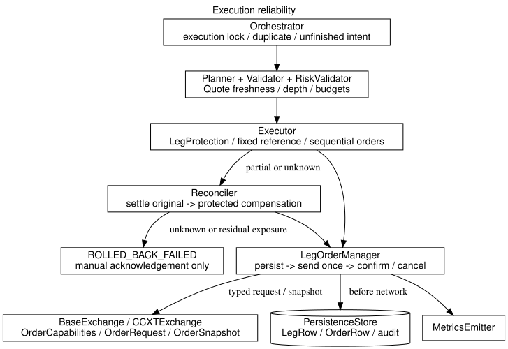

# 交易执行可靠性

## 1. 问题与边界

执行可靠性指的是：按固定价格边界发送订单，按真实累计成交确认数量，并在网络异常、部分成交或进程中断后保留可核查的订单身份。订单已受理不等于已成交，撤单已受理不等于没有成交，补偿单返回 ID 不等于敞口已归零。

系统不保证一定成交或没有亏损。跨交易所不能原子成交；严格保护价可能增加拒单和部分成交。未知状态不能伪装成零敞口，无法确认时进入 `ROLLED_BACK_FAILED`。以下是已实现的软件契约，真实交易所可用性和生产延迟仍需独立验收。

## 2. 架构与命名

图源码：`docs/assets/base-execution-reliability.dot`；重新生成：`scripts/render_diagrams.sh base-execution-reliability`。

| 文件 | 类型与职责 | 依赖边界 |
|---|---|---|
| `src/market/quote.py` | `Quote`：时间、来源、盘口、VWAP、点差与有效性检查 | 不导入 exchange |
| `src/coordinator/protection.py` | `LegProtection`、`build_leg_protection`、`compute_leg_qty`：固定参考价、保护价和向下取整 | 纯计算，不发单 |
| `src/exchange/order.py` | `OrderCapabilities`、`OrderRequest`、`OrderSnapshot`、`OrderFee`、`OrderFill` | 规范化交易所契约，原始 API 细节留在适配层 |
| `src/coordinator/leg_orders.py` | `LegOrderManager`：持久化、发送、查询、撤单后确认 | 原单与补偿共用，不决策补偿方向 |
| `src/coordinator/executor.py` | `Executor`：全腿预检、顺序拆单、并发执行与结果校验 | 只执行已经决定的 Intent |
| `src/coordinator/reconciler.py` | `Reconciler`：逐腿确认原单后补偿、核算剩余敞口 | 只对确定数量补偿 |
| `src/persistence/store.py` | `OrderRow`、`LegRow`：请求、累计快照、错误与时间点 | 只存取数据，不构造领域对象 |

跨交易所套利不复用 `Reconciler` 做跨 venue 对冲。`src/arbitrage/executor.py`
维护 pair-level 周期，默认离线模拟；第三阶段可在显式测试网门控下提交两腿，
成交回报由 Arcus `orders`/`userFills` 或对应 venue 查询确认，主网执行仍被拒绝。
恢复使用保存的 `execution_context_json`、服务端订单 ID 和 client order ID 重建两侧
实际成交；无上下文、网络不匹配、累计成交回退或订单仍活动时转入人工处理，绝不重发。

新增名称登记在[命名规范](../standards/naming-conventions.md)，目录登记在[目录结构](../standards/directory-structure.md)。套利执行边界允许导入 `exchange.order.OrderRequest` 共享请求契约，其他 venue I/O 仍通过注入的适配器对象完成。

## 3. 工作流

1. `Orchestrator.submit` 获取数据库级执行锁，检查重复 Intent、阻断态和未完成 Intent。重复 ID 不再次发单，不同参数重用 ID 会报错。
2. Planner 验证报价新鲜度、盘口排序、有限正数、未交叉和点差，使用深度 VWAP 与 taker 费率估算费用及成本。费用和总成本同时检查 Intent 总额。
3. Validator/RiskValidator 检查规则、余额和风险。dry-run 执行检查但不发单，以 `DRY_RUN` 终态保存。
4. Executor 检查所有 venue 能力、拆单最小数量和最小金额，设置杠杆后重新取行情。任一预检失败时不发送订单。
5. 每条 Leg 的参考价固定为规划时 mid-price；买入保护价向下取整，卖出保护价向上取整。`limit_price` 与滑点价格边界取更严格者。未指定 `max_slippage_pct` 时采用 0.5% 执行保护，默认 IOC。
6. 每腿按 `max_order_notional_usd` 顺序拆单，各腿并发。每笔发送前重新验证行情和剩余预算，持久化 Leg、上下文和唯一订单记录，再写入发送标记；落盘期间报价过期也不发单。
7. `LegOrderManager` 优先等待短期 WS 回报，再使用有 deadline 的 REST 查询。网络异常只查询，绝不盲目重发；缺少成交量或非零成交缺少均价时不能判定完成。
8. 开仓未完成时进入 Reconciler；显式平仓失败直接阻断，不通过反向单重开仓。每条腿先撤销并查询原单最终累计成交，确认后才补偿该腿。各腿仍可并发减少已知敞口。
9. 补偿使用实际成交数量与均价作为基准，IOC 限价保护，perp 使用 reduceOnly。补偿必须确认最终数量；残余金额按 Instrument 的原生数量与合约面值估值，无法确定时为 `null`。补偿不自动追加第二笔重试。

## 4. 持久化与恢复

`legs.execution_context_json` 保存完整 `PlannedLeg` 和 Instrument 快照；`orders` 表以稳定 `client_order_id` 为主键，区分 `original` 与 `compensation`。ID 由 Leg、用途和序号确定，兼容 Hyperliquid 的 128-bit 十六进制格式。请求 JSON 不同不能重用 ID。

SQLite 在发单前先记录 `UNKNOWN` 发送标记。发送后进程退出，即使没有 exchange order ID，也可按 client order ID 查询。`PENDING_SEND` 订单没有越过发送标记，可确认为未发送。SQLite 状态与 JSONL 是顺序写入，**不是跨介质原子事务**；崩溃恢复以 SQLite 已提交的请求与快照为依据。

`onefill recover --intent-id ID --network testnet` 对中断 Intent 查询、撤单和压平，恢复过程中不继续开仓拆单；开仓恢复以发送前基线为目标；平仓不会通过反向开仓恢复原持仓。已进入终态（尤其 `ROLLED_BACK_FAILED`）的 Intent 不自动重试。缺少上下文的旧 Leg 进入人工处理，恢复网络必须与保存的 Instrument 一致。

执行、恢复和本地取消共享数据库文件锁，防止一个进程恢复另一个进程仍在发送的订单。未完成 Intent 会挡住新提交；`cancel` 只能取消没有 Leg 的未发送 Intent，不能把可能在途的订单标成已拒绝来解除阻塞。

## 5. 成本与数量语义

- `max_total_cost_usd` = 不利价格偏差成本 + 手续费；相对固定 mid-price 的偏差已经包含价差成本，不能再次叠加 spread。
- 限价单也可能吃单，预估费用使用 taker 费率。分腿预算按 Intent split 分配，剩余预算不足则停止后续拆单。
- USD/USDT/USDC 按美元等值假设估值；Binance 线性和反向永续显式保存原生数量、合约面值和结算资产。反向成交是否完成按张数比较，基础币值按成交价换算。其他不受支持的 quote 换算仍拒绝。详见 [Binance 接入](base-binance-integration.md)。
- 手续费原币种保留。美元计价币手续费直接估值，基础币手续费按实际成交价估值，其他币种标为未知；设置实际费用/总成本上限时，未知费用不会当作满足预算。
- spot 补偿考虑原单基础币手续费；不足数量步长、手续费导致剩余量或补偿部分成交都可能进入人工处理，不会自动把差额视为零。
- 默认要求全量成交。`min_fill_ratio < 1` 只允许单腿；多腿不接受独立部分成交比例，以免破坏对冲关系。

## 6. 交易所能力与替代方案

Binance 适配声明 GTC/IOC/FOK 与 client ID；Hyperliquid 声明 GTC/IOC 与 client ID，不声明 FOK。native 适配器必须按同一 `OrderCapabilities` 合同声明能力，不能复用 CCXT 异常类型或假设存在统一的 `type`/HMAC 参数。未知适配器默认拒绝受保护执行，不静默降级为市价单。具体产品限制还由交易所 API 校验。

本实现选择受保护限价单，而不是客户端观察到价格偏离后才撤销市价单：后者无法约束已经发生的成交。不引入新的订单服务或消息队列，复用现有 SQLite、CCXT 和五阶段协调器。

Arcus 的可靠性边界还包括：`placeOrder`/`cancelOrder` 返回 `202` 时仅表示请求已接受；最终状态来自 `orders`/`userFills` 或 REST 查询。订单签名使用 Ed25519 typed canonical payload，`ct` 为纳秒时间戳，`g`/`goodTilTime` 必须满足 Arcus 的未来时间要求。能力矩阵需随各 venue 的 API 版本和 testnet 实测维护。交易所接口依据：[Binance 下单接口](https://developers.binance.com/docs/binance-spot-api-docs/rest-api/trading-endpoints)、[Hyperliquid 订单接口](https://hyperliquid.gitbook.io/hyperliquid-docs/for-developers/api/exchange-endpoint)、[Arcus API Reference](../../reference/arcus-api-reference.md)。

## 7. 验证与上线验收

离线验证入口：`uv run --locked pytest -m "not network"`。重点用例位于 `tests/coordinator/test_{protection,leg_orders,executor_reliability}.py`、`tests/exchange/test_order.py`、`tests/persistence/test_order_rows.py`，覆盖响应丢失、重复提交、挂起请求、撤单/成交竞态、部分补偿、重启、迁移和锁。

`MetricsEmitter` 接收报价年龄、下单耗时、实际滑点、未知订单和补偿结果；`orders` 与 `order_sending`/`order_observed` 审计事件保留可重放证据。`onefill query ID --json` 可导出订单请求与快照。默认指标后端仍为 NoopMetrics，接入生产监控由装配层注入。

上线前仍须执行：逐 venue testnet 的 IOC/FOK、客户端 ID 查询和手续费分页验收；在目标部署区域采集 P50/P95/P99；按品种校准价格、成本和 freshness 阈值；验证 NFS 文件锁；小额灰度及人工处置演练。离线 Mock 不能证明生产网络延迟、交易所撮合行为或真实滑点。
