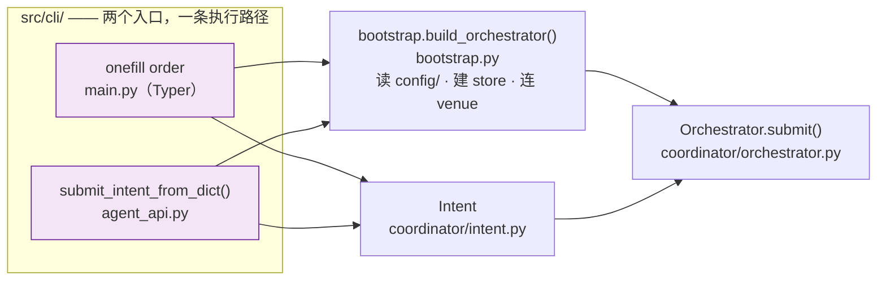

# Agent SDK Integration

oneFill exposes a Python-callable API (`src/cli/agent_api.py`) that can be used
by an external Agent SDK integration. The function is an adapter over the same
Intent and Orchestrator path used by the CLI; it is not a second execution path.

## Entry points



**两条入口汇聚到同一个 `Orchestrator.submit()`，这是这份设计的全部要点。**
`submit_intent_from_dict()` 只做三件事：把字典映射成 `Intent`、装配依赖、调用 `submit()`。
它**不重新实现任何执行逻辑**——没有第二套校验、没有绕过 `NEEDS_MANUAL` 阻断态的后门。
`agent_api.py` 位于 `src/cli/` 而不是 `src/coordinator/`，也是同一个理由：
它是入口适配器，不是执行内核的一部分。

## Quick start

```python
from src.cli.agent_api import submit_intent_from_dict

result = await submit_intent_from_dict(
    {
        "base": "BTC",
        "product": "spot",
        "side": "buy",
        "total_notional_usd": 1000,
        "split": {"binance": 0.5, "hyperliquid": 0.5},
    },
    dry_run=True,
)
print(result["status"])  # "DRY_RUN"
```

The function returns the same JSON-friendly dict that `onefill order --json`
produces.

## Intent dictionary schema

| Key | Type | Required | Default |
|---|---|---|---|
| `base` | str | yes | — |
| `total_notional_usd` | float | yes | — |
| `split` | dict[str, float] | yes | — |
| `product` | str | no | `"spot"` |
| `side` | str | no | `"buy"` |
| `quote_preference` | list[str] | no | `[]` |
| `order_type` | str | no | `"market"` |
| `leverage` | int | no | `1` |
| `max_slippage_pct` | float | no | `None` |
| `max_fee_usd` | float | no | `None` |
| `max_funding_rate_pct` | float | no | `None` |
| `execute_timeout_seconds` | int | no | `30` |
| `time_in_force` | str | no | `None` |
| `leg_configs` | dict[str, dict] | no | `{}` |

## External integration boundary

An external project may register `submit_intent_from_dict` as a tool so users
can express intent in natural language:

> "buy $1000 of BTC across Binance and Hyperliquid, 50/50 split"

Natural-language interpretation, tool registration, authentication and policy
remain outside this repository. The adapter accepts a structured dictionary,
constructs the canonical `Intent`, and returns the same JSON-friendly result as
the CLI. Do not add a second set of domain states or execution semantics here.
