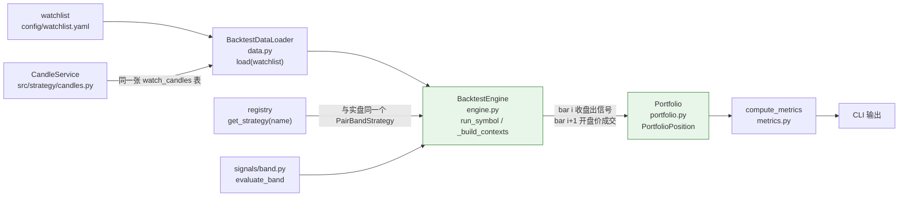

# 回测

`onefill backtest run` 用与实盘 `watch run` **同一个信号引擎**（`PairBandStrategy` +
`evaluate_band`）、**同一张 K 线表**（`watch_candles`）回放历史，因此回测出来的信号就是
实盘会发出的告警。差异只在两处：回测不做 Telegram 推送，且成交价用下一根 bar 的开盘价
而不是当时的市价。

整个回测不碰交易所账户、不发单、不写库（除了 `CandleService` 正常的 K 线增量填充）。

## 组件与数据流



### 不负责什么

| 不负责 | 归谁 |
|---|---|
| 决定买卖方向与时点 | `PairBandStrategy` + `evaluate_band`（与实盘同一个） |
| 推送告警 | `price_watch/` —— 回测不推 Telegram |
| 真实成交 | 回测用下一根 bar 开盘价 + 滑点模拟，没有 venue 参与 |
| K 线的获取与增量填充 | `CandleService`（回测只是它的读取方） |
| 账户、余额、风控 | 回测不碰账户，也不走 `RiskValidator` |

**「与实盘同一个信号引擎」是这份设计里最值钱的一条**：回测和 `watch run` 共用
`PairBandStrategy` 与 `evaluate_band`，共用 `watch_candles`。如果它们各自实现一套信号逻辑，
回测出来的结论就没有任何参考价值——而两套逻辑的差异不会报错，只会让回测结果与实盘行为悄悄分叉。

## 数据加载：`BacktestDataLoader`

`src/strategy/backtest/data.py`。`load(watchlist)` 对每个标的返回
`{"base": rows, "coarse": {iv: rows}, "derived": {iv: rows}}`：

- `base` — 基础周期序列，`CandleService.ensure_filled(item, since_days=days)`，
  解析和增量填充逻辑与实盘完全一致（Hyperliquid → Binance，缺哪段补哪段）。
- `coarse` — 每个 MTF 周期独立读回的历史序列（深度历史）。
- `derived` — 由该标的自身基础序列聚合、缓存在 `derived_candles` 表的粗周期序列
  （覆盖基础窗口）。两者最终由 `mtf.contexts` 合并，派生值优先。

标的解析不到（`resolvable=False`）的直接跳过，不进结果。基础序列都拿不到就没有回测的必要。

## 信号引擎：`BacktestEngine`

`src/strategy/backtest/engine.py`。

`run(data)` 对所有标的各跑一次 `run_symbol`，再把事件按 `ts` 归并成一个全局时间序列
返回。组合层是共享现金池，所以必须看到跨标的按时间排序的完整事件流。

`run_symbol(symbol, bundle)` 逐 bar 喂入：

```python
for i, c in enumerate(base):
    bar = Bar(ts=c["ts"], open=..., high=..., low=..., close=..., context=bar_contexts[i])
    sig = strat.on_bar(bar)
    if sig is None or i + 1 >= len(base):
        continue
    nxt = base[i + 1]
    fill = self._fill_price(nxt["open"] or nxt["close"], sig.direction)
```

### 无未来函数（no-lookahead）

这是回测唯一重要的不变量，分三处保证：

1. **成交价用下一根 bar。** 第 `i` 根收盘产生信号，成交价取第 `i+1` 根的 `open`，
   而不是第 `i` 根的 `close`——第 `i` 根的收盘价在那一刻是「最新价」，
   但用它成交等于假设能在收盘瞬间精确成交。
2. **最后一根 bar 的信号丢弃。** `i + 1 >= len(base)` 时没有下一根可成交，信号直接丢弃，
   不能回退用当前 bar 收盘价成交。
3. **滑点方向固定。** `_fill_price` 对买入乘 `(1 + slippage_pct)`、对卖出乘
   `(1 - slippage_pct)`，两个方向都是对交易者不利的一侧。

策略侧的时点正确性由 `mtf.contexts` 保证（只用 `ts` 所在桶之前的粗 bar），
见[策略框架](strat-framework.md)。

MTF 买入门同样生效：`strat.buy_prefilter = make_buy_prefilter(mtf_intervals[0], mtf_sma)`，
主周期取 `mtf_intervals` 的第一个。`mtf_intervals` 为空时返回 `[{} ...]` 上下文且不拦截。

## 组合：`Portfolio`

`src/strategy/backtest/portfolio.py`。共享现金池模型，参数 `capital`、`per_trade_usd`、`fee_rate`。

`execute(event)` 按方向分派到 `_buy` / `_sell`，更新 `last_price[symbol]`，然后记一次净值：

- `_buy`：买 `per_trade_usd / price` 的数量，成本加手续费。**现金不够就跳过这笔**
  （而不是加杠杆或部分成交）。同一标的多笔买入按数量加权平均成本。
- `_sell`：**卖该标的全部持仓**，`pnl = (price - avg_cost) * qty - fee`，计入 `realized_pnl`。
  没有持仓的卖出被忽略——策略在回测里不会发出这样的信号，但事件流是共享的，
  防御掉比假设它不会发生更安全。
- `equity()` = 现金 + 所有持仓按 `last_price` 计的开仓市值。每笔成交后记一次净值点，
  `equity_curve` 是 `(时间戳, 净值)` 序列。

## 指标：`compute_metrics`

`src/strategy/backtest/metrics.py`。返回：

| 字段 | 含义 |
|---|---|
| `capital` / `final_equity` / `return_pct` | 初始资金、期末净值、总收益率 |
| `realized_pnl` | 已实现盈亏合计 |
| `num_trades` / `num_sells` | 成交笔数 / 其中卖出笔数 |
| `win_rate_pct` | 盈利卖出占卖出笔数的比例 |
| `profit_factor` | 总盈利 / 总亏损（无亏损且有盈利时为 `inf`） |
| `avg_win` / `avg_loss` | 平均每笔盈利 / 亏损 |
| `max_drawdown_pct` | 净值曲线的最大回撤 |

胜率、盈亏比都只统计 `side == "sell"` 的成交——买入不产生已实现 pnl，
把它算进分母会把胜率稀释掉。

## CLI 输出

`onefill backtest run` 默认渲染指标表加每笔成交记录；`--json` 输出指标对象加
`trades` 数组。命令参数见 `docs/user-guide/cli/index.md`。

## 模块位置

| 文件 | 内容 |
|---|---|
| `src/strategy/backtest/data.py` | `BacktestDataLoader` |
| `src/strategy/backtest/engine.py` | `BacktestEngine` |
| `src/strategy/backtest/portfolio.py` | `Position`、`Portfolio` |
| `src/strategy/backtest/metrics.py` | `compute_metrics` |
