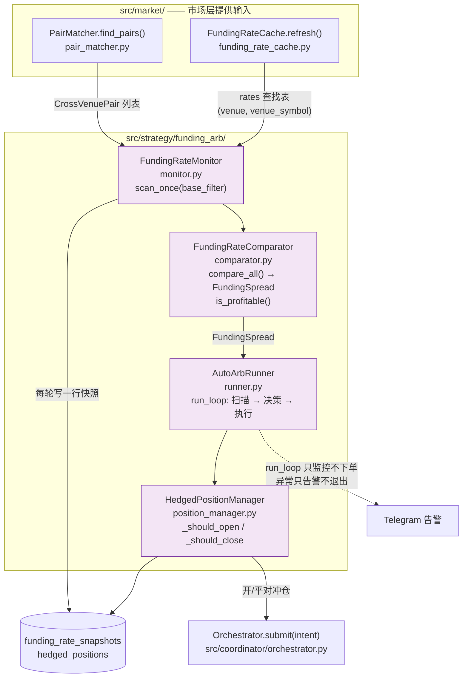

# 资金费率套利

> 第 1–6 节记录的是**为什么**这么做：从「吃费率差」到「premium 均值回归」的模型推导。
> 第 7 节记录的是**代码怎么落地**这套模型。判断当前行为以第 7 节和源码为准。

## 1. 资金费率的本质

资金费率不是独立的价格信号，而是**永续合约价格偏离现货价格的校正机制**。

```
funding_rate ≈ perp_mark_price - spot_price   (简化形式)

perp > spot → rate > 0 → 多头付费给空头 → 抑制做多, 激励做空 → perp 价格被压回
perp < spot → rate < 0 → 空头付费给多头 → 抑制做空, 激励做多 → perp 价格被抬回
```

**费率是均值回归的。它的存在就是为了消灭自身。** 如果你今天看到一个 0.10% 的正费率，它正在被设计成会趋向于 0。

## 2. 为什么"吃费率差"赚不到钱

### 旧模型（仅用于解释当前决策）

```
profit = spread × notional × time - fees - slippage

假设: 双边交易所同时、对称地产生 funding 收益
```

### 为什么错

Funding 是**离散结算**的，不是连续累加：
- Hyperliquid: 每小时结算一次
- Binance: 每 8 小时结算一次
- 提前平仓 → 0 funding（没有按比例分配）

**不同步结算 → 时序风险：**

```
t=0:    HL rate=-0.05%, Binance rate=+0.03%, spread=0.08%
        开仓: long HL + short Binance

t=1h:   HL 结算, 收到 0.05%
        HL 新费率 = +0.01%（费率差消失）
        平仓: Binance 0 funding + 双边手续费
```

在这种场景下：
- HL 收入 = +0.05%
- Binance 支出 = 0
- 手续费 = 0.20%（5bp taker × 4 trades）
- **净亏损 = -0.15%**

日常的 0.05-0.10% funding spread 根本无法覆盖双边手续费。

## 3. 真正的利润来源: Premium 均值回归

当两个交易所的 perp 出现异常的 premium 偏离时，套利机会才出现。

```
正常状态: Binance BTC perp premium ≈ HL BTC perp premium ≈ 0%
异常状态: Binance +0.50%, HL -0.30% → spread = 0.80%
```

**这不是在赌 funding rate 差会持续，而是在赌 premium 会回归到均衡水平。**

### 利润分解

```
net_profit = funding_collected + premium_convergence_pnl - fees - slippage

其中:

premium_convergence_pnl = (premium_A_initial - premium_A_final) × direction_A
                        + (premium_B_final - premium_B_initial) × direction_B

当 premium 回归到均值:
  - long HL (premium=-0.30%): HL perp 价格上升 → +0.30%
  - short Binance (premium=+0.50%): Binance perp 价格下跌 → +0.50%
  - convergence_pnl = 0.30% + 0.50% = 0.80%

加上 funding:
  - HL 结算 1h: +0.30%
  - 总收益 = 0.80% + 0.30% = 1.10%

扣除成本:
  - fees = 0.20%
  - net = 1.10% - 0.20% = 0.90% ✓
```

### 什么情况下会出现这种大 spread

- 某个交易所出现流动性危机（大量强制平仓推高/压低 perp 价格）
- 市场剧烈波动时不同交易所反应速度不同
- 大户在单个交易所大额开仓导致短期 premium 偏离
- 某个交易所的做市商暂时下线

这些事件发生的频率不高，但一旦发生，spread 足够大就能覆盖所有成本。

## 4. 正确的策略框架

### 不是"持续吃费率差"

不要期望每天每个币种都有套利机会。正常市场条件下确实没有。

### 而是"异常检测 → 均值回归下注"

1. **持续监控 premium index**（perp mark price vs spot index price）— 这是领先指标
2. **当某个交易所出现显著偏离时触发信号**（例如 premium > 0.3% 或 < -0.3%）
3. **开对冲仓位**: long discount venue + short premium venue
4. **当 premium 回归到均衡水平时平仓**: 赚 convergence_pnl + 期间收到的 funding
5. **在首次结算后评估**: 如果 spread 已消失 → 平仓。如果还在 → 继续持有

### 关键指标: Premium Index（而非 Funding Rate）

| 指标 | 性质 | 为什么重要 |
|---|---|---|
| Funding Rate | 滞后指标（基于过去的 premium） | 告诉你过去发生了什么 |
| Premium Index | 领先指标（当前的市场定价偏差） | 告诉你现在发生了什么 |
| Next Funding Time | 结算时间 | 告诉你什么时候必须决策 |

Funding rate 是 premium 的滞后表示。Premium index 才是实时信号。当 premium 偏离时，funding rate 还没变，但套利窗口已经打开了。

## 5. 盈利充分条件

在下面的条件下，套利是确定盈利的:

```
条件 1: funding_rate_A 和 funding_rate_B 的方向必须相反
        （一个正一个负，意味着存在 cross-venue divergence）

条件 2: abs(premium_A) + abs(premium_B) > 2 × (fee_A + fee_B)
        （premium 回归的收益足以覆盖双边 4 笔手续费）

条件 3: 开仓前确认两个 venue 的 perp 都在正常交易中
        （避免在一方做市商缺失时开仓）
```

当这三个条件同时满足时：
- 即使 funding rate 在开仓后立刻消失，premium mean-reversion 的收益也足以 cover 所有成本
- 策略不依赖时间（不需要等 8 小时），只依赖价格的正常回归

## 6. 实践考量

### 为什么不总是有这种机会

- 市场大部分时间是有效的，cross-venue premium divergence 很小（< 0.05%）
- 当出现大 divergence 时，专业做市商和高频交易者会比我们更快
- 我们的优势是：可以坐等（HF 有资金成本）、可以跨 CEX（HF 通常只在一个交易所做市）

### 什么事件会创造机会

| 事件类型 | 典型 spread | 持续时间 | 频率 |
|---|---|---|---|
| 大户单边开仓 | 0.1-0.3% | 几分钟到几小时 | 每天数次 |
| 交易所限价单失衡 | 0.2-0.5% | 数十分钟 | 每周数次 |
| 强制平仓潮 | 0.5-2.0% | 几分钟 | 每月数次 |
| 极端波动 | 1.0-5.0% | 数分钟到数小时 | 每季度 |

## 7. 实现

代码在 `src/strategy/funding_arb/`，数据流：



**`run_loop` 与 `AutoArbRunner` 是两条不同的路径，这条区别是刻意的**：
`run_loop` 是纯监控循环（`onefill arb scan`），只看不下单，单轮异常只告警不退出；
真实下单只发生在 `AutoArbRunner` 经 `Orchestrator.submit()` 的路径上——
策略层**不自己发单**，这一点与[策略框架](strat-framework.md) 开头的约束一致。

### 7.1 扫描

`FundingRateMonitor.scan_once(base_filter)`（`monitor.py`）：

1. `PairMatcher.find_pairs(base_filter)` 给出同 base、两所均为 perp 且 `trading` 的
   两两配对（`CrossVenuePair`）；无配对直接返回 `[]`。
2. 按 `(venue, venue_symbol)` 去重收集全部 `Instrument`，交给
   `FundingRateCache.refresh(...)` 批量刷费率。
3. 从缓存取回每个 instrument 的费率条目，组成 `rates` 查找表。
4. `FundingRateComparator.compare_all(pairs, rates)` 产出 `FundingSpread` 列表。
5. 每个 instrument 写一行 `funding_rate_snapshots`（`onefill arb history` 读的就是这张表）。

`run_loop(interval_seconds)` 是不下单的纯监控循环：每轮 `scan_once`、记 top spread 与持仓数，
单轮异常只告警不退出。

### 7.2 盈利模型：`FundingRateComparator`

`comparator.py` 是第 3–5 节模型的可执行版本。`compute_net_return(...)` 的五步：

1. **方向门**——两个费率为同号（都正或都负）时直接返回 `is_profitable=False`。
   没有跨所背离就没有均值回归可赌，这一条对应第 5 节的条件 1。
2. **收敛收益**——`convergence_pnl = (|premium_a| + |premium_b|) * 0.5`。
   只算一半，是刻意的保守假设（不指望完全回归）。
3. **收取的 funding**——只取**先结算的那个 venue**（由 `_funding_hours(next_funding_time, now)`
   的较小值定出 `venue_first`），且取费率绝对值较小一侧的费率。依据是第 2 节的时序风险：
   提前平仓时后结算的一边拿不到钱。`next_funding_time` 缺失或已过期时回退按 8 小时算。
4. **成本**——`fee_cost_pct = (taker_fee_a + taker_fee_b) * 2 * 100`，即双边各两笔、
   共 4 次 taker；`slippage_cost_pct` 为两侧滑点之和。
5. **净额**——`net = convergence + funding - costs`，`is_profitable = net > 0`。
   `net_annual_pct` 按最短结算周期年化，**仅用于展示与排序**，不参与判定。

`compare(pair, ...)` 接上单个配对的输入产出 `FundingSpread`：`spread = rate_b - rate_a`；
`signal` 在可盈利且 `abs(spread) * 100 > min_spread_pct` 时给出方向——`spread > 0` 说明
a 所费率高，做空 a / 做多 b（`open_long_a_short_b`），否则 `open_short_a_long_b`。
`compare_all` 跑完所有配对后按「可盈利优先，其次年化净收益降序」排序。

`premium_a`/`premium_b` 由 `compare_all` 从费率缓存条目的 `premium_pct` 字段取；
缓存没提供该字段时默认 0，此时收敛收益为 0，模型退化成只看 funding 与成本。

### 7.3 决策循环：`AutoArbRunner`

`runner.py`，参数 `ArbConfig`（由 `onefill arb run` 的旗标填充）：`min_spread_pct`、
`exit_spread_pct`、`notional_per_leg`、`max_positions`、`interval_seconds`、`dry_run`。

`_tick()` 分两阶段：

**阶段 1 — 检查已有仓是否该平。** 对每个 `OPEN` 持仓，`_find_spread` 找同 base 的最新 spread，
`_should_close` 在两种情况下返回真：

- 找不到对应 spread → 该配对已不可交易（不再是 `trading`，或不在当前配对里）；
- `spread.is_profitable` 为假 → 价差扣掉成本后不再值得持有。

**阶段 2 — 找新仓。** 逐条遍历 spreads，依次过滤：`signal == "none"` 跳过；
同 base 已有持仓跳过；已达 `max_positions` 停止；`abs(spread) * 100 < min_spread_pct` 跳过；
`_should_open` 要求 `spread.is_profitable`。

注意**阈值在两个地方**：`build_arb_scanner` 用默认参数构造 `FundingRateComparator()`
（`min_spread_pct=0.0`），所以 comparator 的 `signal` 几乎总是给出方向；
真正生效的门槛是 `ArbConfig.min_spread_pct`（`--min-spread`，默认 0.01），在 `_tick` 里判断。

### 7.4 开仓与平仓

两条路径都构造 `Intent` 交给 `Orchestrator.submit`——套利层**不直接发单**，
仍然走执行内核的先落盘后发单、失败回滚那一套（见[协调流程](base-coordination-pipeline.md)）。

开仓 `_open_position(spread)`：由 `signal` 决定哪一所做多哪一所做空，构造一个
`total_notional_usd = notional_per_leg * 2`、`split` 两所各 0.5、`leverage=1` 的 perp Intent，
并用 `LegConfig` 把两条腿分别覆盖为 `side="buy"` 与 `side="sell"`（见[产品与领域约束](sys-product-requirements.md)
的逐腿覆盖规则）。提交成功后 `HedgedPositionManager.record_open(...)` 记一行持仓。

平仓 `_close_position(pos)`：构造方向相反的 Intent（两腿 side 对调），成功后 `record_close`。

两处都按 `result["status"]` 判断：开仓接受 `ALL_FILLED` / `DRY_RUN` / `REJECTED`，
平仓接受 `ALL_FILLED` / `ROLLED_BACK`；其余状态只记错误日志。

`dry_run=True` 时两个方法都只写日志就返回，不发单；`run()` 的循环是
`_tick()` → 睡 `interval_seconds` → 重复，捕获 `asyncio.CancelledError` 后退出。

### 7.5 持仓台账：`HedgedPositionManager`

`position_manager.py`，状态存在 `hedged_positions` 表：

- `record_open(pair, notional_per_leg, intent_id, leg_long_id, leg_short_id, rate_a, rate_b)`
  ——生成 `hp-<12位>` 的 `position_id`，写一行 `OPEN`，返回该 id；
- `record_close(position_id, intent_close_id)` ——置为已平，记下平仓的 intent；
- `get_open_positions()` ——读回所有未平仓，并**重建** `CrossVenuePair`
  （从存的 `venue_long`/`venue_short`/`symbol_*` 字段拼出最小 `Instrument`）。
  重建出的 `Instrument` 只带 `venue`/`market_type`/`base`/`quote`/`venue_symbol`，
  `network` 固定为 `testnet`，所以它**只够用来标识配对，不能拿来下单或取行情**。

`onefill arb positions` 读的就是这张表。

## 8. 模块位置

| 文件 | 内容 |
|---|---|
| `src/strategy/funding_arb/monitor.py` | `FundingRateMonitor`（扫描 + 落快照） |
| `src/strategy/funding_arb/comparator.py` | `FundingRateComparator`、`FundingSpread`、`NetReturn`（盈利模型） |
| `src/strategy/funding_arb/runner.py` | `AutoArbRunner`、`ArbConfig`（决策循环） |
| `src/strategy/funding_arb/position_manager.py` | `HedgedPositionManager`、`HedgedPosition` |
