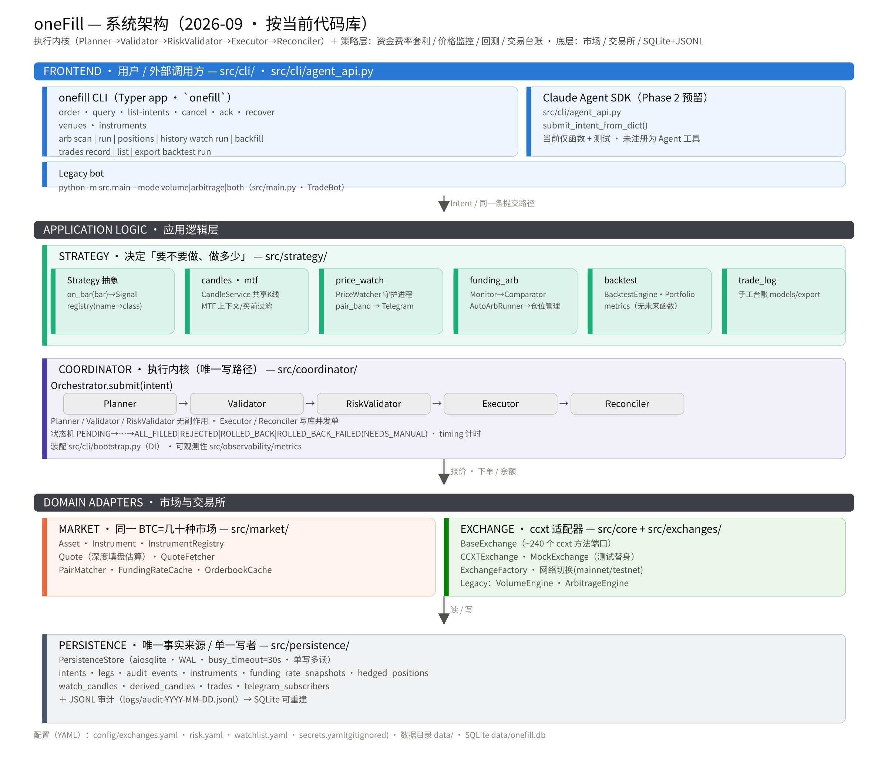

# 系统架构与工作流（全系统视角）

> 本文件按**当前代码库**绘制（2026-09），覆盖 oneFill 全链路：执行内核、资金费率套利、
> 价格监控、回测、交易日志、legacy 机器人与底层市场/交易所/持久化。
> 本文件是当前系统架构的唯一正文；组件细节分别在本目录的各专题页面中说明。

---

## 0. 架构图（SVG / PNG，已持久化）

矢量 SVG 与高清 PNG 均落在 `docs/assets/`，可与本文件一起提交：

- `../../assets/architecture.svg`（矢量，可缩放 / 编辑，浏览器直接打开）
- `../../assets/architecture.png`（2400×2100 高清栅格，适合 README / 文档内嵌）



> 图中颜色取自默认 dataviz 分类配色（各层一色，固定顺序，经色觉校验），中文由 Noto Sans SC 渲染。

---

## 1. 一句话总览

oneFill 是一个**多交易场所有序执行引擎**，随开发演进已扩展为一个「执行 + 策略」的复合系统：

- **执行内核（产品核心）**：一次 CLI 指令 → 跨多个交易所在毫秒级同时下单 → 保证协调终局
  （全部成交 / 部分成交自动反向对冲 / 对冲失败则进入 `NEEDS_MANUAL` 阻断后续）。
- **策略层（后加）**：在「是否交易、交易多少」这个执行内核之上，叠加了三套消费执行内核的下游：
    - 资金费率套利（`onefill arb`）——扫描跨所 perp 费率/溢价差，自动开对冲仓、价差收敛自动平仓；
    - 价格监控（`onefill watch`）——拉取 K 线、跑 pair-band 轮动信号、Telegram 推送告警；
    - 回测（`onefill backtest`）——用与实盘相同的信号引擎 + 相同 K 线数据回放历史，评估策略。
- 底层共享：市场抽象（Asset/Instrument/Quote）、交易所适配器（ccxt）、SQLite + JSONL 持久化。

> 当前 CLI 有 12 个顶层命令、18 个叶子操作。判断以本文件与源码为准。

---

## 2. 系统架构图

```text
┌────────────────────────────────────────────────────────────────────────────────────────────┐
│ FRONTEND  用户 / 外部调用方                                                                     │
│                                                                                            │
│  ┌───────────────────────────────┐   ┌────────────────────────────────────────────────┐   │
│  │ onefill CLI   (src/cli/main)  │   │ External Agent SDK adapter                │   │
│  │  Typer app, 12 top-level      │   │  src/cli/agent_api.py  submit_intent_from_dict()│   │
│  │                               │   │  （通过同一 Intent 提交路径接入，工具注册在外部项目完成）        │   │
│  │ order   query   list-intents  │   │                                                │   │
│  │ cancel  ack     recover       │   │                                                │   │
│  │ venues  instruments           │   │                                                │   │
│  │                               │   │                                                │   │
│  │ arb  scan|run|positions|history│   │                                                │   │
│  │ watch run|backfill            │   │                                                │   │
│  │ trades record|list|export     │   │                                                │   │
│  │ backtest run                  │   │                                                │   │
│  └───────────────┬───────────────┘   └───────────────────────┬────────────────────────┘   │
│  Legacy: python -m src.main --mode volume|arbitrage|both     │                            │
│  (src/main.py TradeBot)                                      │                            │
└──────────────────┼───────────────────────────────────────────┼────────────────────────────┘
                   │                                           │ (同一条 Intent 提交路径)
                   ▼                                           ▼
┌────────────────────────────────────────────────────────────────────────────────────────────┐
│ APPLICATION LOGIC  (intelligence + coordination)                                              │
│                                                                                            │
│  ══ STRATEGY (src/strategy/) —— 决定「要不要做、做多少」                                      │
│      策略抽象 Strategy(on_bar→Signal) + registry                                            │
│      │ middle_ware: candles(CandleService) · mtf(多周期上下文) · backtest(引擎/组合/指标)     │
│      │                                                                                     │
│      ├─ price_watch/  PriceWatcher 守护进程 → pair_band 信号 → TelegramSender 告警           │
│      ├─ funding_arb/  FundingRateMonitor → Comparator → AutoArbRunner → HedgedPositionMgr   │
│      └─ trade_log/    手工交易台账（models/export）                                          │
│                                                                                            │
│  ══ COORDINATOR (src/coordinator/) —— 执行内核（确定「怎么执行」）                            │
│      Orchestrator.submit(intent)                                                           │
│      Planner → Validator → RiskValidator → Executor → Reconciler                           │
│            │           │            │           │           │                             │
│            └───────────┴────────────┴───────────┴───────────┘   + 状态机 / timing          │
│  ──────────────────────────────────────────────────────────────────────────────────────     │
│  CLI 装配 (src/cli/bootstrap.py): build_orchestrator / build_store / build_arb_scanner /      │
│      build_price_watcher / build_backtest                                                    │
│  可观测性 (src/observability): MetricsEmitter / NoopMetrics                                  │
└──────────────────┬──────────────────────────────────────────┬───────────────────────────────┘
                   │                                          │
┌──────────────────▼───────────────────┐  ┌───────────────────▼──────────────────────────────┐
│ MARKET LAYER  (src/market/)           │  │ EXCHANGE LAYER (src/exchange)        │
│  “同一个 BTC 是几十种不同市场”           │  │  BaseExchange (抽象基类, ~240 个 ccxt 方法端口)    │
│  Asset          BTC/USDT             │  │  CCXTExchange · MockExchange(测试替身)              │
│  Instrument   (venue,type,base,quote)│  │  ExchangeFactory → config/exchanges.yaml          │
│  InstrumentRegistry  find_one/load    │  │  连网/切网(NETWORK_ENUM) / 建仓/撤单/查单/余额      │
│  Quote         orderbook+深度填盘估    │  │   funding_rate/statistics 等补充字段              │
│  QuoteFetcher  WS缓存→REST 兜底        │  │                                               │
│  PairMatcher · FundingRateCache       │  │  LEGACY   (src/legacy)                           │
│  OrderbookCache · MockBackend         │  │   VolumeEngine · ArbitrageEngine                  │
└──────────────────┬───────────────────┘  └───────────────────┬──────────────────────────────┘
                   │                                          │
                   └──────────────┬───────────────────────────┘
                                  │
┌─────────────────────────────────▼─────────────────────────────────────────────────────────┐
│ PERSISTENCE  (src/persistence)  —— 唯一事实来源 / 单一写者                                  │
│  PersistenceStore (aiosqlite, WAL + busy_timeout, 单写多读)                                 │
│  ┌──────────────┬──────────────────────────────────────────────────────────┐              │
│  │ SQLite       │  data/onefill.db                                          │              │
│  │  intents     │  ← 意图状态机 (PENDING→…→ALL_FILLED/REJECTED/ROLLED_BACK…)│              │
│  │  legs        │  ← 每条腿的订单/成交/对冲                              │              │
│  │  audit_events│  ← 全量审计事件表                                    │              │
│  │  instruments │  ← 交易对缓存 (TTL 24h)                              │              │
│  │  funding_rate_snapshots  ← 费率快照                                │              │
│  │  hedged_positions         ← 对冲套利仓                            │              │
│  │  watch_candles            ← 监控 K 线窗口 (asset,venue,interval,ts) │              │
│  │  derived_candles          ← 派生的粗周期 K 线 (MTF 上下文)          │              │
│  │  trades                   ← 手工交易台账                            │              │
│  │  telegram_subscribers     ← Telegram 动态订阅                        │              │
│  ├──────────────────────────────────────────────────────────────────────────┤              │
│  │ JSONL (append-only)  logs/audit-YYYY-MM-DD.jsonl                        │              │
│  │  每个事件双写: SQLite 表 + JSONL 行，SQLite 可重建                       │              │
│  └──────────────────────────────────────────────────────────────────────────┘              │
└────────────────────────────────────────────────────────────────────────────────────────────┘

配置 (YAML): config/exchanges.yaml · risk.yaml · watchlist.yaml · secrets.yaml(gitignored)
```

---

## 3. 分层说明

| 层 | 目录 | 职责 | 有无副作用 |
|---|---|---|---|
| 前端 | `src/cli/` | 参数解析、rich/JSON 渲染、`bootstrap` 装配、`agent_api` 程序化入口 | 无（仅装配） |
| 策略 | `src/strategy/` | 决定交易方向（信号），并消费执行内核 | `arb run`/`watch run` 会发单 |
| 执行内核 | `src/coordinator/` | Plan→Validate→Risk→Execute→Reconcile 五段流水线 | Executor/Reconciler 会发单 |
| 市场 | `src/market/` | 统一 venue/quote/product 差异，填盘估算 | 无（纯读） |
| 交易所 | `src/exchange/` | 统一 ccxt 接口、连网鉴权 | 网络 I/O |
| 持久化 | `src/persistence/` | SQLite 状态 + JSONL 审计 | 写库 |
| 可观测性 | `src/observability/` | 指标发射（默认 no-op） | 无 |

**为什么需要市场层**：同一个「BTC」对应几十种 `Instrument`（spot/perp、USDT/USDC/USD、Binance/Hyperliquid），
价格、深度、费率、funding 各不相同。任何上层都必须把它们当作不同市场。跳过该抽象就会「跟自己对手交易」。

---

## 4. 数据落盘映射

| 表 | 写入者 | 读取者 | 关键字段 |
|---|---|---|---|
| `intents` | Orchestrator.submit | `query`/`list-intents`/`recover`/`is_blocked` | status, raw_intent_json |
| `legs` | Executor(下单前)/Reconciler | `query`, exposure/pnl | venue, status, order_id, filled_amount, compensation_* |
| `audit_events` | 每次 append_event | 审计/重建 | event_type, payload_json |
| `instruments` | InstrumentRegistry.load_all→save | Planner, `instruments` 命令, `_precheck` | TTL 24h |
| `funding_rate_snapshots` | arb scan/monitor | `arb history` | funding_rate, next_funding_time |
| `hedged_positions` | AutoArbRunner | `arb positions` | venue_long/short, intent_open |
| `watch_candles` | CandleService | watch tick, backtest 数据源 | (asset,venue,interval,ts) |
| `derived_candles` | mtf.ensure_derived | MTF 上下文 | 粗周期聚合 OHLCV |
| `trades` | `trades record` + Telegram `/log` | `trades list/export` | pnl 自动匹配 |
| `telegram_subscribers` | `/subscribe`/`/unsubscribe` | `_refresh_chat_ids` | chat_id |

---

## 5. 核心工作流

### 5.1 启动装配（bootstrap）

`src/cli/bootstrap.py` 是每个命令的公共「组装工厂」，注入式 DI（测试用 `_exchanges`/`_store`/`_telegram`）：

1. 读 `config/exchanges.yaml` + `config/secrets.yaml`（已注入则跳过）。
2. `ExchangeFactory.initialize_exchanges()` → 为每个 `enabled:true` 的交易所建 `CCXTExchange` → `connect()`。
3. `PersistenceStore(sqlite, jsonl)` → `initialize()`（迁移 + 建表 + WAL + busy_timeout）。
4. `InstrumentRegistry.load_all(exchanges, store)` → 缓存命中则读 `instruments` 表，否则逐所 `list_markets()` 抓取并写回缓存。
5. 可选：`OrderbookCache`（ccxt.pro WS 订单簿）→ `QuoteFetcher(exchanges, cache)`。
6. 可选：`RiskValidator(store, risk.yaml)`。
7. 组装 `Orchestrator`。

### 5.2 `onefill order` —— 协调执行（核心）

`src/cli/main.py:order` → `src/coordinator/orchestrator.py:submit`：

| 步骤 | 阶段 | 副作用 | 说明 |
|---|---|---|---|
| 0 | CLI 参数解析 | 无 | `parse_split`（`venue=ratio[:side[:product[:leverage]]]`）、`parse_quote_preference` → 构建 `Intent`（校验 split 求和=1、spot 杠杆=1 等） |
| 0.5 | 缓存预检 | 无 | 对每个 split venue 查 `instruments` 缓存，缺失时仅警告不阻断（Validator 才是硬门） |
| 1 | 阻断门 | 无 | `is_blocked_by_needs_manual()` 为真 → 直接 REJECT |
| 2 | 落盘 PENDING | 写库 | `create_intent(intent, status=PENDING)` |
| 3 | **Planner** | 无 | 每 venue：`registry.find_one(base,venue,product,quote_preference)` → `quote_fetcher.fetch_many`（WS 缓存→REST 兜底；perp 补 funding/统计字段）→ notional=total×ratio、`round_qty`、`quote.estimate_fill`（走盘口算均价/滑点/是否吃满深度）→ 预估 fee → 阈值检查（滑点/费用/funding）。被拒 venue 记入 `rejected_venues`。产出 `Plan`(legs + aggregate + is_acceptable) |
| 3.5 | DRY_RUN | 无 | `--dry-run` 直接返回 plan 信息，不发单 |
| 4 | 计划不合格 | 写库 | `!is_acceptable` → REJECT |
| 5 | **Validator** | 无 | 每腿并发：`listing_status==trading`、que 存在、qty≥min_qty、余额充足（spot 需 notional；perp 需 notional/leverage 的 free margin，且 `set_leverage`≤max_leverage） |
| 6 | 落盘 VALIDATED | 写库 | 校验通过 |
| 6.5 | **RiskValidator** | 无 | 读 `risk.yaml`：单笔最大名义、当日累计亏损(`get_daily_pnl`)、单所敞口(`get_venue_exposure`)、速率限制。失败 → REJECT |
| 7 | **Executor** | 写库+发单 | 置 EXECUTING → **先 `create_leg` 写腿行，再发单** → `asyncio.gather` 并发 `create_order`（perp 先 `set_leverage`）→ 填充确认先 WS(`watch_orders`) 后 HTTP 轮询（自适应退避、早停）→ 全成 → ALL_FILLED，否则 PARTIAL_FILLED |
| 8 | **Reconciler** | 发单 | 若 PARTIAL_FILLED：置 ROLLING_BACK → 已成交腿发反向单（spot 反手市价 / perp reduceOnly 平仓）+ 未成交腿撤单并发 → 全对冲成功 → ROLLED_BACK；否则 → ROLLED_BACK_FAILED（= NEEDS_MANUAL，**阻断后续**） |

**状态机**（`state_machine.py`）：

```
PENDING → VALIDATED → EXECUTING ─┬─→ ALL_FILLED            (成功)
   │          │                  │
   │          └─→ REJECTED       ├─→ PARTIAL_FILLED → ROLLING_BACK ─┬─→ ROLLED_BACK   (已补偿)
   │                             │                                  │
   │                             └─→ (EXECUTE_TIMEOUT)              └─→ ROLLED_BACK_FAILED
   │                                                                     │ (NEEDS_MANUAL, 阻断)
   └─→ REJECTED                                                          └─→ RESOLVED_MANUAL (ack)
```

终态：`ALL_FILLED` / `REJECTED` / `ROLLED_BACK` / `ROLLED_BACK_FAILED` / `RESOLVED_MANUAL`。
CLI 退出码：0=全成，1=一般错误，2=拒绝，3=已回滚，4=需人工。

**硬规则**：每次 `create_order` 前必须先有持久化的 leg 行（Executor 强制），这是「下了单却没记录」的主防线。

### 5.3 `onefill arb` —— 资金费率套利

理论见 `strat-funding-arb.md`（收益 = 溢价收敛 + funding 收取 − 费用 − 滑点；溢价是先导指标）。

- **scan（一次性）**：`PairMatcher.find_pairs`（同 base、均为 perp、`trading`，跨所两两组合）→ `FundingRateCache.refresh`（各所 `fetch_market_statistics`/funding）→ `FundingRateComparator.compare_all`（溢价模型算 `is_profitable`、`signal`）→ 写 `funding_rate_snapshots` → 返回 spreads。
- **run（daemon）**：`AutoArbRunner` 死循环：`scan_once` → 已有仓检查（价差不 profitable / 对不再可交易 → `_close_position`）→ 新开仓（构建 Intent：a 所 long、b 所 short，含 `LegConfig` 覆盖，经 `Orchestrator.submit`）→ 记 `hedged_positions`。`--dry-run` 只记录不发单。
- **positions / history**：读 `hedged_positions` / `funding_rate_snapshots`。

```
PairMatcher ──→ FundingRateCache ──→ Comparator(scans/decides) ──→ AutoArbRunner(loop)
                                                                │
                                           ┌────────────────────┴─────────────┐
                                           │ 开仓 Intent (a long / b short)   │
                                           ▼                                ▼
                                     Orchestrator.submit        HedgedPositionManager
                                                                (hedged_positions 表)
```

### 5.4 `onefill watch` —— 价格监控 + Telegram 告警

- **run（daemon）/ backfill（一次性）** 共用 `backfill()` 播种逻辑；`run` 额外跑 tick 循环 + 告警。
- 数据链路：`CandleService.ensure_filled`（按 `DEFAULT_VENUES=["hyperliquid","binance"]` 依次解析，失败落到下一所；增量 gap-fill；第一个周期按 history_days 深种，之后只补尾部）→ 写 `watch_candles` → 从库读回窗口。
- 信号：`window_extremes` + `latest_close` → 构造 MTF 上下文（`mtf.contexts` 读 `derived_candles` 粗周期，算 `coarse_trend`）→ 逐标的 `PairBandStrategy.on_bar`（跌 `--buy-drop-pct` 自窗口高→BUY 并记买入价；涨 `--sell-rise-pct` 高过买入价→SELL；MTF buy_prefilter 在下行趋势挡买入）→ 有信号出 `Signal` → `_deliver` Telegram。
- 心跳：每 `--heartbeat`（默认 4h）发存活消息。
- Telegram 命令（后台轮询 `getUpdates`，仅 whitelist master 可发）：
  - `/subscribe`/`/start`、`/unsubscribe`/`/stop` → 增删 `telegram_subscribers`；
  - `/status` → 计数；
  - `/log <symbol> <buy|sell> <qty> <price> [venue][tag][fee][strategy][reason]`（仅私聊）→ 写 `trades` 表，**sell 自动配对最近未匹配 buy 并算 pnl**。

### 5.5 `onefill backtest run`

与实盘 `watch run` 共享 `evaluate_band` 信号引擎 + 同一条 `watch_candles` 数据，故回测信号 = 实盘告警。

`build_backtest` → `CandleService` + `BacktestDataLoader`（拉 N 天 + MTF 粗周期）→ `BacktestEngine.run`（逐标的实例化策略；**无未来函数**：bar i 收盘出信号 → 以 bar i+1 开盘价 + 滑点成交；最后一 bar 丢弃）→ `Portfolio.execute`（共享现金池，每买 `per_trade_usd`，卖整仓、扣费，实时 mark-to-market）→ `compute_metrics`。`--json` 输出指标 + 每笔记录。

### 5.6 `onefill trades` —— 手工交易台账

独立于 oneFill 订单（不自动推导）：`record` 记录一笔，`list`/`export` 读取导出；`tag` 与 watchlist 类别对应，`strategy`/`reason` 自由填。同表由 Telegram `/log` 写入。

### 5.7 Legacy bot（`python -m src.main`）

`TradeBot`：进程锁(`fcntl.flock`)防止多开 → `ExchangeFactory` 连交易所 → 依 `--mode` 初始化 `ArbitrageEngine` 和/或 `VolumeEngine`（刷量需要≥2 所）→ 依 mode 起任务 → 优雅停机（平掉所有活跃仓、释放锁）。`src/legacy/` 含 HedgeVolume。该入口作为兼容路径独立维护。

---

## 6. 关键不变量

1. **先落腿行、后发单**：任何 `create_order` 前必有持久化 leg 行（Executor 强制）。
2. **`NEEDS_MANUAL` 阻断后续**：不提供「自动从 NEEDS_MANUAL 恢复」路径，只能 `onefill ack` 升级人工确认。
3. **逐腿 product/side/leverage 覆盖 Intent 默认值**：spot 腿杠杆必须=1（`Intent.__post_init__` 校验）。
4. **只有市场层知道 venue 原生符号**：上层一律用 `Instrument`，CLI 只用 `--base`/`--quote-preference`。
5. **Planner/Validator 无副作用**：Executor/Reconciler 有副作用（测试正依赖此属性）。
6. **Legacy VolumeEngine 保证金安全**：开仓前查 free margin，不足则 3×5min 重试后自动平最低成本仓。
7. **Legacy 刷量以 USD 名义计**，非币数。

---

## 7. 维护边界

本文件只描述当前源码中已经存在的模块和流程。新增模块、状态或命令时，必须同时更新源码、测试、[产品与领域约束](sys-product-requirements.md)和本文件；旧流程不再适用时直接删除旧描述，不在正文中保留并列版本。

---

## 8. 常用命令速查

```bash
uv run onefill order --dry-run --base BTC --product spot --side buy --type market \
  --total-notional-usd 1000 --split binance=0.5,hyperliquid=0.5 --network testnet
uv run onefill query <intent-id> && uv run onefill list-intents --status ROLLED_BACK_FAILED
uv run onefill recover && uv run onefill ack <intent-id>
uv run onefill instruments --base BTC --refresh
uv run onefill arb scan --base BTC && uv run onefill arb run --interval 60 --dry-run
uv run onefill watch backfill --network mainnet
uv run onefill watch run --network mainnet
uv run onefill backtest run --network mainnet --symbols BTC,ETH,SOL --days 30
uv run onefill trades record --symbol BTC --side buy --qty 0.01 --price 60000 --tag leader
uv run pytest -m "not network"
uv run python -m src.main --mode volume --network testnet   # legacy
```
