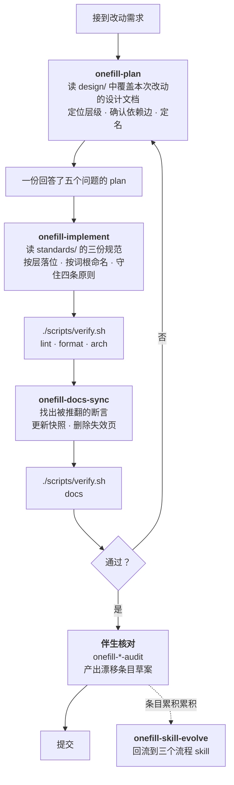

# Harness

本目录记录 AI 在本项目中开发时**必须走的流程**，以及承载这个流程的可执行件。
它服务于开发过程本身，不描述产品行为——产品行为见[系统架构](../design/sys-architecture.md)。

本目录按**四层**组织，建设方法来自 `meta-skills/`——那是项目启动时
一次性使用的范本库，建成之后就不再更新。本节描述的是**本项目的实际形态**。

| 层 | 内容 | 位置 |
|---|---|---|
| 认知层 | 架构图 + workflow 文档，开发前先读 | [`../design/`](../design/)（产物）、`meta-skills/1-`（方法） |
| 执行层 | 三个阶段流程 skill | [`skills/`](skills/onefill-plan/SKILL.md) |
| 生成层 | 非固定流程 skill 与元 skill | 未启用（见 §7） |
| 演化层 | 伴生件：核对型 + 自进化型 | [`drift-ledger/`](drift-ledger/PROTOCOL.md)、`onefill-*-audit/`、`onefill-skill-evolve/` |

## 1. 这个 harness 解决什么问题

[docs-paradigm](../../docs-paradigm.md) §5、§8、§9 已经用散文规定了完整的开发流程：
编码前读文档、复用已有概念、代码完成后同步文档、提交前跑验证。问题在于**散文不会在需要的
时刻出现在上下文里**——它躺在文档里，直到有人想起来去读它。

Skill 解决的是时机问题：它按需加载，在「正要设计一个改动」「正要写代码」「刚改完代码」
这三个时刻分别进入上下文。文档依旧是权威，skill 是它在那三个时刻的可执行形式。

## 2. 开发闭环



三个阶段都收尾于同一个门禁脚本，这一点是刻意的：**门禁的失败是明确的，而「规则读过了吗」
永远无法验证**。闭环能不能咬合，取决于每一段末尾有没有一个会当场报错的检查。

**最后一步不是装饰。** `I` 之前的所有环节都只在「人记得跑」时生效；
一次功能开发完成后自动跑核对，是让「文档写对了但代码变了」这类失效**变得可见**的唯一通道。
没有这一环，上面每一份规范的有效期都等于下一次变更的时间。

## 3. 三个阶段

| Skill | 触发时机 | 读什么 | 产出 |
|---|---|---|---|
| [onefill-plan](skills/onefill-plan/SKILL.md) | 动手前、进入 plan mode 前 | `design/` 下 `applies_to` 覆盖本次改动的文档 | 回答了五个问题的 plan |
| [onefill-implement](skills/onefill-implement/SKILL.md) | 写 `src/`、`tests/` 之前与过程中 | `standards/` 的三份规范（按决定查节） | 落位正确的代码 + 通过的 `arch` 门禁 |
| [onefill-docs-sync](skills/onefill-docs-sync/SKILL.md) | 代码改完之后 | 被改动推翻断言的文档 | 与代码一致的 `docs/` |

三者的分工对应三种不同的失效：**设计漂移**（方案与架构冲突）、**实现漂移**（代码违反分层与命名）、
**文档漂移**（文档描述的系统已经不存在）。最后一个此前没有任何机制覆盖。

正文文件存放在本目录的 `skills/<name>/SKILL.md`；`.claude/skills/<name>` 是指向它们的**相对符号链接**。
Claude Code 按目录名发现项目 skill，链接让同一份内容既能被它读取，又留在 `docs/` 里可被
MkDocs 渲染、可被人直接阅读——**只有一份副本，不会漂移**。Skill 按 `description` 自动触发，
也可以用 `/<name>` 手动调用。

### 演化层的伴生件

每个范式的产物都配一份伴生 skill。**产物是流程时用自进化型，产物是断言时用核对型**——
判据按主产物形态定，方法见 `meta-skills/7-`。

| 伴生 skill | 类型 | 核对 / 回流什么 |
|---|---|---|
| [onefill-docs-audit](onefill-docs-audit/SKILL.md) | 核对型 | `docs-paradigm.md` —— 文档树、元数据、断言、生命周期禁令、交叉链接四处 |
| [onefill-naming-audit](onefill-naming-audit/SKILL.md) | 核对型 | `naming-conventions.md` —— 词根表、后缀表、术语表、例外登记、**登记表自身是否仍成立** |
| [onefill-dirstruct-audit](onefill-dirstruct-audit/SKILL.md) | 核对型 | `directory-structure.md` —— 目录树、收录规则、超限清单、测试镜像、§9 现状声明 |
| [onefill-arch-audit](onefill-arch-audit/SKILL.md) | 核对型 | 架构分析范式 §7 —— 图 ↔ 源码双向对账、骨架完整性、不变量与失败门禁 |
| [onefill-skill-evolve](onefill-skill-evolve/SKILL.md) | 自进化型 | 上面三个**流程** skill 的「与描述不符之处」回流 |

**这五个共用一套台账。** 条目的字段、状态机、索引结构、记录格式、三类回流判定全部定义在
[漂移台账协议](drift-ledger/PROTOCOL.md)，各 skill 只写自己「核对什么、怎么核对」，
不重复协议内容——这是 7- 的「单一知识源」原则，也是本目录 §6 对 skill 正文的同一要求。

台账当前为空（[INDEX.md](drift-ledger/INDEX.md)）。这是正常的起点：
它的价值随条目累积而增长，而条目只在每次开发完成后被真正跑一次时才会产生。

## 4. 验证门禁

`scripts/verify.sh` 是 [docs-paradigm](../../docs-paradigm.md) §9 与 `CLAUDE.md`
「Disk quota」两节所述手工步骤的可执行形式：

```bash
./scripts/verify.sh            # 六个阶段全跑：lint · format · arch · skills · test · docs
./scripts/verify.sh lint arch  # 只跑指定阶段（写代码过程中用）
```

它封装了两件手工执行时容易出错的事：家目录磁盘配额已满，所有缓存必须重定向到
`/share_data/wangziping/`，否则 `uv` / `pytest` / `ruff` 直接 `EDQUOT` 失败；
以及 `mkdocs build --strict` 需要 `--group docs`。

## 5. 什么被机器保证，什么没有

诚实地分开这两类，才能知道闭环哪里会漏。

**机器保证**（失败即报错，与是否记得读规则无关）：

- 跨层依赖边与循环导入 —— `tests/test_architecture.py`
- `persistence/` 不导入业务层、import 期无副作用、`config/` 只在 `src/cli/` 读
- 公开符号名全项目唯一
- 凭据不出现在 `docs/` 和 `tests/`
- 文档的死链与孤儿页 —— `mkdocs build --strict`
- 代码风格 —— ruff（含编辑时自动运行的钩子）

**Skill 覆盖但机器判不了**（需要判断，没有客观判据）：

- 方案是否与架构的设计意图冲突
- 异常消息是否带够了定位上下文
- 文档中被推翻的断言 —— 链接还在，只是不再成立
- 一段内容该更新，还是根本不该存在

第二类不能靠加强散文来解决，这也是它们被写成 skill 而不是写成规范条款的原因：
skill 至少保证了相关的判据在决策发生的时刻在上下文里。

**核对覆盖、但机器判不了**里的第三项正是演化层要接的：那句「链接还在，只是不再成立」
描述的就是核对型伴生件存在的全部理由。§3 的五个 skill 把它从一句认识变成了可执行动作。

## 6. 维护

新增一个 skill 时，同步更新本文 §3 的表格——否则它会变成又一份没人知道存在的清单。

Skill 的内容只写**规则**，不写**快照**：不要在 skill 里复制设计文档清单、依赖边表或
命名后缀表，而是指向规范的哪一节。复制出来的第二份会在下次架构调整时腐烂，
而且它腐烂时没有任何检查会发现。这条对伴生 skill 同样适用——它们引用
[漂移台账协议](drift-ledger/PROTOCOL.md) 的条目 schema，而不是各自定义一套。

**改动任何一个 `SKILL.md` 后，用校验脚本验证。** frontmatter 的字段集合是封闭的
（`name` / `description` / `license` / `allowed-tools` / `metadata` / `compatibility`），
多一个键 skill 就装不上，而**加载失败是静默的**——文件看起来没问题，加载器只是跳过它：

```bash
uv run --locked python scripts/validate_skills.py   # 或 ./scripts/verify.sh skills
```

这条已经是 `verify.sh` 的 `skills` 阶段，所以提交前跑全量时不会漏。
文档元数据的五个字段要写就挂在 `metadata:` 下，**不得平铺进 frontmatter**——
`meta-skills/4-` §6 与 `5-` §6 都给出了会被拒绝的字段组合。

## 7. 生成层为什么未启用

`meta-skills/5-flexible-procedure/` 描述的是**非固定流程**的固化方法：目标已知、步骤未知，
需要反复探索且要让经验可积累。本项目的四个策略功能域目前都不属于这一类——
它们的步骤已经能写成判据，属于执行层。

按 `meta-skills/README.md` 的落地顺序（执行层 → 演化层 → 认知层 →
生成层），生成层的价值上限最高，但**对前三者的完备度依赖最强，过早建设只会得到一份无法被
验证的产物**。等到某个功能域真的出现「每次都要重新探索」的情况时再启用它，
届时 `meta-skills/5-` 连同 `examples/` 下的完整实例就是入口。
