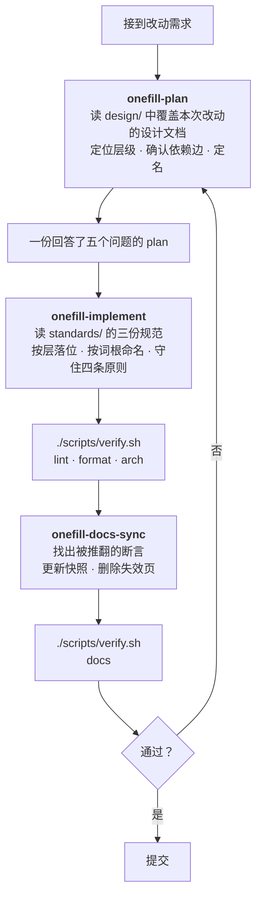

# LLM Harness

本目录记录 AI 在本项目中开发时**必须走的流程**，以及承载这个流程的可执行件。
它服务于开发过程本身，不描述产品行为——产品行为见[系统架构](../design/sys-architecture.md)。

## 1. 这个 harness 解决什么问题

[docs-paradigm](../../docs-paradigm.md) §5、§8、§9 已经用散文规定了完整的开发流程：
编码前读文档、复用已有概念、代码完成后同步文档、提交前跑验证。问题在于**散文不会在需要的
时刻出现在上下文里**——它躺在文档里，直到有人想起来去读它。

Skill 解决的是时机问题：它按需加载，在「正要设计一个改动」「正要写代码」「刚改完代码」
这三个时刻分别进入上下文。文档依旧是权威，skill 是它在那三个时刻的可执行形式。

## 2. 开发闭环



三个阶段都收尾于同一个门禁脚本，这一点是刻意的：**门禁的失败是明确的，而「规则读过了吗」
永远无法验证**。闭环能不能咬合，取决于每一段末尾有没有一个会当场报错的检查。

## 3. 三个阶段

| Skill | 触发时机 | 读什么 | 产出 |
|---|---|---|---|
| [onefill-plan](skills/onefill-plan/SKILL.md) | 动手前、进入 plan mode 前 | `design/` 下 `applies_to` 覆盖本次改动的文档 | 回答了五个问题的 plan |
| [onefill-implement](skills/onefill-implement/SKILL.md) | 写 `src/`、`tests/` 之前与过程中 | `standards/` 的三份规范（按决定查节） | 落位正确的代码 + 通过的 `arch` 门禁 |
| [onefill-docs-sync](skills/onefill-docs-sync/SKILL.md) | 代码改完之后 | 被改动推翻断言的文档 | 与代码一致的 `docs/` |

三者的分工对应三种不同的失效：**设计漂移**（方案与架构冲突）、**实现漂移**（代码违反分层与命名）、
**文档漂移**（文档描述的系统已经不存在）。最后一个此前没有任何机制覆盖。

正文文件存放在本目录的 `skills/<name>/SKILL.md`；`.claude/skills/<name>` 是指向它们的**相对符号链接**。
Claude Code 按目录名发现项目 skill，链接让同一份内容既能被它读取，又留在 `docs/` 里可被
MkDocs 渲染、可被人直接阅读——**只有一份副本，不会漂移**。Skill 按 `description` 自动触发，
也可以用 `/<name>` 手动调用。

## 4. 验证门禁

`scripts/verify.sh` 是 [docs-paradigm](../../docs-paradigm.md) §9 与 `CLAUDE.md`
「Disk quota」两节所述手工步骤的可执行形式：

```bash
./scripts/verify.sh            # 五个阶段全跑：lint · format · arch · test · docs
./scripts/verify.sh lint arch  # 只跑指定阶段（写代码过程中用）
```

它封装了两件手工执行时容易出错的事：家目录磁盘配额已满，所有缓存必须重定向到
`/share_data/wangziping/`，否则 `uv` / `pytest` / `ruff` 直接 `EDQUOT` 失败；
以及 `mkdocs build --strict` 需要 `--group docs`。

## 5. 什么被机器保证，什么没有

诚实地分开这两类，才能知道闭环哪里会漏。

**机器保证**（失败即报错，与是否记得读规则无关）：

- 跨层依赖边与循环导入 —— `tests/test_architecture.py`
- `persistence/` 不导入业务层、import 期无副作用、`config/` 只在 `src/cli/` 读
- 公开符号名全项目唯一
- 凭据不出现在 `docs/` 和 `tests/`
- 文档的死链与孤儿页 —— `mkdocs build --strict`
- 代码风格 —— ruff（含编辑时自动运行的钩子）

**Skill 覆盖但机器判不了**（需要判断，没有客观判据）：

- 方案是否与架构的设计意图冲突
- 异常消息是否带够了定位上下文
- 文档中被推翻的断言 —— 链接还在，只是不再成立
- 一段内容该更新，还是根本不该存在

第二类不能靠加强散文来解决，这也是它们被写成 skill 而不是写成规范条款的原因：
skill 至少保证了相关的判据在决策发生的时刻在上下文里。

## 6. 维护

新增一个 skill 时，同步更新本文 §3 的表格——否则它会变成又一份没人知道存在的清单。

Skill 的内容只写**规则**，不写**快照**：不要在 skill 里复制设计文档清单、依赖边表或
命名后缀表，而是指向规范的哪一节。复制出来的第二份会在下次架构调整时腐烂，
而且它腐烂时没有任何检查会发现。
